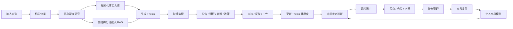
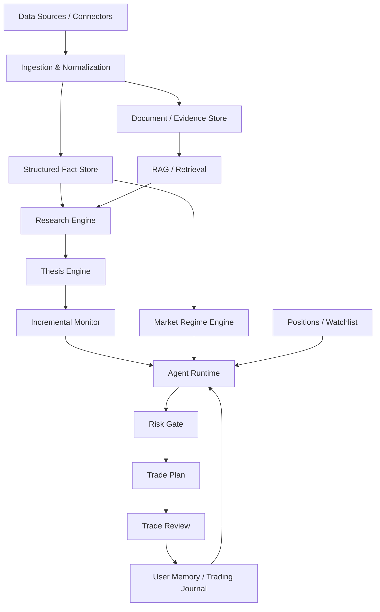

# 论衡 ThesisGuard

> **论其逻辑，衡其风险。**  
> **ThesisGuard — Protect the Thesis. Control the Risk.**

**论衡 ThesisGuard** 是一个面向个人投资者的 AI 驱动交易决策系统。

它不是一个简单的“股票问答机器人”，也不是一个只负责给出“买 / 卖”结论的黑盒模型，而是一套围绕 **研究、验证、市场状态、风险控制、持仓管理、交易纪律与长期复盘** 构建的个人交易 Agent。

ThesisGuard 的核心目标不是预测每一天的涨跌，而是帮助用户持续回答以下问题：

- 我为什么持有这只股票？
- 支撑原始投资逻辑的事实有没有发生变化？
- 当前标的是“机构趋势型”还是“游资情绪型”？
- 当前市场环境是否允许增加风险？
- 这个买点是否值得承担风险？
- 如果判断错误，在哪里认输？
- 新机会是否真的优于当前持仓？
- 我是在执行系统，还是被情绪驱动？
- 我在什么市场环境下最容易赚钱，又在什么环境下最容易犯错？

---

## 1. 项目定位

### 1.1 一句话介绍

**ThesisGuard 是一个以“投资逻辑持续验证 + 市场风险状态机 + 交易纪律约束”为核心的个人交易智能体。**

它将：

**公司研究 → 投资逻辑 → 新闻 / 公告 / 政策 → 市场情绪 → 买点 → 仓位 → 风控 → 持仓 → 复盘**

连接成一个持续运行的交易决策闭环。

---

## 2. 为什么做 ThesisGuard

传统个人投资流程通常是碎片化的：

- 研报在一个地方；
- 自选股在一个地方；
- K 线和盘口在另一个地方；
- 新闻和公告靠手工查看；
- 交易计划写在笔记里；
- 止损位经常临盘修改；
- 买入理由和卖出理由没有形成版本记录；
- 一段时间后甚至忘记当初为什么买；
- 大模型每次回答问题又重新搜索一次，没有持续积累；
- 用户强烈表达某个观点时，AI 还可能顺势迎合。

ThesisGuard 希望解决的不是“缺一个更聪明的聊天机器人”，而是：

> **个人投资者缺少一套能够持续保存研究、更新事实、验证逻辑、控制风险，并且约束交易行为的长期交易操作系统。**

---

## 3. 品牌含义

### 论衡

“论”，代表：

- 投资逻辑；
- 公司研究；
- 产业判断；
- 事实证据；
- Thesis。

“衡”，代表：

- 收益与风险的权衡；
- 仓位与机会成本的权衡；
- 基本面与技术位置的权衡；
- 用户观点与客观事实的权衡；
- 当前机会与现有持仓的权衡。

### ThesisGuard

**Thesis**：投资逻辑、核心假设。  
**Guard**：守卫、验证、风险控制。

因此 ThesisGuard 的含义并不是“守住一只股票”，而是：

> **守住你的投资逻辑，及时发现逻辑失效，并在错误扩大以前控制风险。**

---

# 4. 核心原则

ThesisGuard 的所有功能都必须遵守以下原则。

## 4.1 Thesis First

股票不是代码，持仓也不是一串成本价。

每一个进入自选池或持仓池的标的，都必须拥有明确的投资逻辑：

- 为什么关注？
- 核心驱动是什么？
- 市场低估了什么？
- 哪些事实支持当前判断？
- 哪些条件出现后逻辑失效？

---

## 4.2 Fact > Narrative

系统必须尽可能区分：

1. **事实**
2. **推断**
3. **市场预期**
4. **用户假设**
5. **Agent 判断**

不能把故事当成事实，也不能因为用户强烈看多某只股票就提高评分。

---

## 4.3 先判断市场，再判断个股

一只公司的产业逻辑没有变化，并不意味着今天就适合买入。

任何开仓建议都应该先经过：

**市场状态 → 风险预算 → 个股逻辑 → 技术位置 → 盈亏比**

而不是直接从“公司不错”跳到“可以买”。

---

## 4.4 不同类型的股票，使用不同模型

ThesisGuard 不使用一套万能评分模型解释所有股票。

### 机构趋势型

重点判断：

- 产业景气；
- 公司竞争力；
- 订单；
- 收入；
- 利润；
- 现金流；
- 盈利预测；
- 估值；
- 机构资金；
- 趋势结构。

### 游资情绪型

重点判断：

- 题材强度；
- 龙头地位；
- 情绪周期；
- 梯队；
- 历史连板基因；
- 换手；
- 封板质量；
- 市场辨识度；
- 风险释放。

### 混合驱动型

同时存在产业逻辑与短期资金驱动，但两套逻辑必须分开观察，不能混为一谈。

### 事件驱动型

围绕明确事件、催化剂、政策或突发变化建立独立验证链。

---

## 4.5 Risk Before Opportunity

任何机会分析之前，先回答：

- 当前市场风险是多少？
- 当前总仓位是多少？
- 单票还能承担多少风险？
- 持仓之间是否高度相关？
- 是否已经达到持仓容量上限？
- 是否存在明确止损位？

---

## 4.6 不因为下跌而加仓

ThesisGuard 的基本原则：

> **只允许因为“更对了”而加仓，不允许因为“跌了很多”而加仓。**

合理加仓理由包括：

- 财报超预期；
- 新订单得到验证；
- 盈利预测上修；
- 产业趋势进一步确认；
- 突破后回踩确认；
- 原始 Thesis 健康度提高。

不合理理由包括：

- 跌多了；
- 感觉便宜；
- 想摊薄成本；
- 害怕踏空；
- 不愿意承认第一次判断错误。

---

# 5. 产品核心闭环



完整流程可以概括为：

> **分类 → 深研 → 入库 → 监控 → 验证 → 风控 → 交易 → 复盘 → 学习**

---

# 6. 自选池不是收藏夹

ThesisGuard 中，“加入自选”意味着正式创建一份可持续维护的标的档案。

首次加入后，系统应执行：

1. 识别股票；
2. 判断交易类型；
3. 生成首次深度研究；
4. 提取结构化事实；
5. 保存原始证据；
6. 生成核心 Thesis；
7. 创建验证条件；
8. 创建风险条件；
9. 设置事实有效期；
10. 开启增量监控。

以后再询问同一只股票时，系统应优先读取已有研究，而不是每次从零搜索。

---

# 7. Company Research Package

每只机构趋势型或产业驱动型标的，都应该拥有一个持续更新的：

**Company Research Package**

建议至少包含以下内容：

## 公司画像

- 主营业务；
- 主要产品；
- 收入结构；
- 毛利结构；
- 核心客户；
- 供应链位置；
- 行业竞争格局。

## 产业逻辑

- 行业景气度；
- 行业增速；
- 渗透率；
- 国产替代；
- 供需格局；
- 技术升级；
- 政策驱动。

## 订单验证

重点跟踪：

- 在手订单；
- 新签订单；
- 合同负债；
- 发出商品；
- 存货；
- 扩产；
- 客户验证；
- 新产能投放。

## 财务验证

持续跟踪：

- 营业收入；
- 归母净利润；
- 扣非净利润；
- 毛利率；
- 净利率；
- 经营现金流；
- 应收账款；
- 存货；
- 资本开支。

## 盈利预期

记录：

- 市场一致预期；
- 机构预测；
- 用户自己的盈利预测；
- Agent 独立预测；
- 上修 / 下修原因。

## 估值

包括：

- PE；
- PEG；
- PS；
- EV/EBITDA；
- 历史估值区间；
- 同行业可比公司；
- Bull / Base / Bear 三种情景。

## 催化剂

例如：

- 财报；
- 新订单；
- 新客户；
- 新产品；
- 行业政策；
- 产能释放；
- 价格上涨；
- 大客户 CapEx。

## 风险

例如：

- 订单不及预期；
- 利润率下降；
- 客户集中；
- 扩产延期；
- 估值过高；
- 行业需求下滑；
- 减持；
- 定增；
- 重大监管风险。

---

# 8. Thesis 健康度

ThesisGuard 不只保存“看多理由”，而是持续维护每一条核心 Thesis。

例如：

| Thesis | 内容 | 当前健康度 |
|---|---|---:|
| T1 | AI 服务器液冷业务进入快速放量周期 | 90% |
| T2 | 后续利润可能高于当前市场一致预期 | 76% |
| T3 | 当前估值尚未完全反映盈利上修 | 68% |

当新的公告、财报、新闻或调研信息出现时，系统需要对每条 Thesis 标记：

- **支持**
- **反驳**
- **中性**
- **证据不足**

并重新计算 Thesis 健康度。

因此用户最终看到的不应该只是：

> “今天有一条新闻。”

而应该是：

> “这条新闻支持 T1，但对 T2 没有直接证明；当前总 Thesis 健康度由 82 降到 78。”

---

# 9. 研究知识库

ThesisGuard 的研究层建议分成两部分。

## 9.1 结构化事实层

用于保存“当前最新真值”。

例如：

- 股票基础信息；
- 季度营收；
- 净利润；
- 毛利率；
- 经营现金流；
- 存货；
- 合同负债；
- 在手订单；
- 盈利预测；
- 估值；
- 当前评分；
- 持仓成本；
- 风险线；
- 交易计划；
- Thesis 状态。

## 9.2 非结构化证据层

用于保存“为什么”。

例如：

- 年报；
- 半年报；
- 季报；
- 公司公告；
- 投资者交流；
- 调研纪要；
- 券商研报；
- 行业报告；
- 政策原文；
- 新闻；
- 电话会纪要。

每条证据都需要尽可能保留：

- 来源；
- 发布时间；
- 获取时间；
- 原始链接；
- 引用片段；
- 对应公司；
- 对应 Thesis；
- 有效期。

---

# 10. 增量研究，而不是重复研究

ThesisGuard 的重要能力之一是：

> **Research Once, Update Incrementally.**

第一次研究一家公司时，可以进行完整深度研究。

之后不应该每次重新生成一份完全新的报告，而应该先回答：

1. 上一次研究是什么时候？
2. 哪些事实仍然有效？
3. 哪些事实已经过期？
4. 最近是否出现重大新事件？
5. 哪些 Thesis 被新增证据影响？
6. 是否需要局部重新研究？

这样可以显著降低：

- 搜索成本；
- Token 成本；
- 重复工作；
- 不同时间回答自相矛盾的问题。

---

# 11. 机构趋势模型

当前原型中的机构趋势模型包含 8 个核心维度：

| 因子 | 权重 |
|---|---:|
| 行业景气 | 15 |
| 公司竞争力 | 15 |
| 订单验证 | 15 |
| 利润兑现 | 15 |
| 盈利预期 | 10 |
| 估值赔率 | 10 |
| 机构资金 | 10 |
| 技术趋势 | 10 |

总分：

**100 分**

机构趋势模型的核心不是寻找最热的股票，而是寻找：

> **产业趋势正在兑现，并且订单、收入、利润、估值和资金开始形成共振的公司。**

---

# 12. 游资情绪模型

对于短线题材、连板、情绪博弈型标的，不强行套用长期产业模型。

当前原型中的游资情绪模型：

| 因子 | 权重 |
|---|---:|
| 题材强度 | 20 |
| 龙头地位 | 20 |
| 情绪周期 | 15 |
| 历史连板基因 | 10 |
| 换手 | 10 |
| 封板质量 | 10 |
| 市场辨识度 | 10 |
| 风险 | 5 |

核心关注：

> **题材 → 龙头 → 梯队 → 情绪 → 换手 → 辨识度**

而不是强行研究三年后的产业空间。

---

# 13. 市场情绪 / 风险状态机

ThesisGuard 将市场划分为七个阶段：

1. 恐慌杀跌
2. 情绪冰点
3. 修复反弹
4. 正常活跃
5. 加速活跃
6. 亢奋极值
7. 高位退潮

系统判断市场阶段时，不能只看一个指标，而需要综合：

- 上涨 / 下跌家数；
- 涨停 / 跌停家数；
- 炸板率；
- 成交额；
- 相对 20 日成交活跃度；
- 主要指数结构；
- 60 分钟 / 日线趋势；
- 连板生态；
- 核心板块强度；
- 情绪斜率；
- 当前状态持续时间。

---

## 13.1 示例仓位闸门

| 市场阶段 | 示例总仓位区间 | 核心原则 |
|---|---:|---|
| 恐慌杀跌 | 10%–25% | 保护现金 |
| 情绪冰点 | 15%–30% | 冰点不是底部 |
| 修复反弹 | 30%–45% | 先试错，再确认 |
| 正常活跃 | 50%–70% | 回归选股 |
| 加速活跃 | 50%–65% | 防止 FOMO |
| 亢奋极值 | 30%–50% | 主动降低新增风险 |
| 高位退潮 | 15%–35% | 禁止亏损补仓 |

以上区间属于策略参数，最终应支持用户配置和历史回测，不应被视为固定真理。

---

# 14. 为什么“冰点”不能直接抄底

ThesisGuard 明确反对：

> 情绪冰点 = 可以满仓抄底

冰点只表示市场非常弱。

真正允许提高风险暴露，需要进一步确认：

- 下跌家数快速收敛；
- 核心指数停止创新低；
- 成交不再继续萎缩；
- 核心板块率先出现主动性；
- 情绪斜率由负转正；
- 反弹出现二次确认。

第一笔仓位应该是：

**确认仓 / 试错仓**

而不是：

**赌最低点仓位。**

---

# 15. 持仓管理

ThesisGuard 默认遵循：

> **最佳持仓数量 3 只，特殊情况下最多 4 只。**

原因是个人投资者的：

- 研究能力有限；
- 盯盘能力有限；
- 信息处理能力有限；
- 风险认知有限。

持仓过多很容易形成：

> 看似分散，实际无法理解任何一只股票。

---

## 15.1 第五只股票规则

当已有 4 只持仓时，第 5 只默认禁止直接开仓。

系统必须先完成：

**新标的 VS 当前持仓**

机会成本 PK。

比较维度包括：

- 上行空间；
- 下行风险；
- Thesis 健康度；
- 催化剂；
- 盈利确定性；
- 技术位置；
- 市场状态；
- 与当前组合相关性。

只有新标的综合明显胜出时，才允许：

> **替换，而不是继续增加。**

---

# 16. 组合相关性

ThesisGuard 不能只看到：

> 我持有 4 只股票。

还要继续判断：

> 这 4 只股票是不是本质上都在交易同一个风险因子？

例如同时持有：

- 光模块；
- 液冷；
- PCB；
- AI 服务器零部件；

表面是四家公司，实际上可能高度暴露于同一个：

**北美 AI CapEx / AI 算力周期**

因此系统需要维护：

- 行业暴露；
- 主题暴露；
- 客户暴露；
- 宏观因子暴露；
- 高相关风险。

---

# 17. 新闻 / 政策 Intelligence

ThesisGuard 不应该成为新闻阅读器。

真正需要回答的是：

1. 发生了什么？
2. 为什么重要？
3. 影响哪个行业？
4. 影响哪些公司？
5. 是影响收入、利润还是估值？
6. 是短期情绪还是长期基本面？
7. 是否已经 Price In？
8. 是否改变现有 Thesis？

例如：

> “数据中心能效要求提升”

不能直接得出：

> “利好液冷。”

系统应进一步拆解：

**能效政策  
→ PUE 要求  
→ 数据中心散热方案变化  
→ 液冷渗透率  
→ 设备价值量  
→ 供应商收入占比  
→ 利润弹性  
→ 估值影响**

---

# 18. Agent 对话

ThesisGuard 的聊天窗口不是一个独立的通用聊天机器人。

在回答交易相关问题前，它应该自动加载：

- 当前市场状态；
- 用户自选池；
- 当前持仓；
- Company Research Package；
- Thesis；
- 最新公告；
- 新闻与政策；
- 交易计划；
- 历史交易；
- 纪律记录；
- 用户长期行为模式。

因此用户可以直接问：

> 今天市场适合开仓吗？

> 强瑞技术原始逻辑有没有失效？

> 这两个标的哪个更值得替换我的现有持仓？

> 今天有哪些新闻真正影响我的组合？

> 这次我想加仓，是因为逻辑更强了，还是因为我不愿意认亏？

---

# 19. Agent 必须能够不同意用户

ThesisGuard 的长期目标不是：

> 越来越像用户。

而是：

> 越来越了解用户在哪些环境下容易赚钱，在哪些环境下容易犯错。

因此系统必须具有“反迎合”机制。

例如用户说：

> “我觉得明天一定会涨。”

Agent 不能因为用户表达强烈信心就提高股票评分。

正确流程应该是：

1. 记录为“用户假设”；
2. 查找支持证据；
3. 查找反对证据；
4. 给出独立判断；
5. 明确说明与用户观点是否一致；
6. 如果不同意，必须说明理由。

---

# 20. 交易纪律中心

ThesisGuard 将纪律视为交易系统的一部分，而不是附加功能。

## 买入前五问

### ① 为什么买？

必须明确：

- 产业；
- 订单；
- 情绪；
- 事件；
- 或其他可验证驱动。

### ② 市场低估了什么？

没有预期差，只有故事，不买。

### ③ 为什么是今天？

需要明确：

- 日线方向；
- 60 分钟结构；
- 当前触发条件。

### ④ 错了在哪里认输？

回答不出来：

**禁止开仓。**

### ⑤ 对了准备赚多少？

默认要求：

**预期盈亏比 ≥ 2:1**

否则不值得承担交易风险。

---

# 21. 交易宪法

ThesisGuard 当前核心交易规则：

1. 默认持有 3 只，特殊情况下最多 4 只；
2. 第 5 只必须完成持仓替换 PK；
3. 机构趋势票和游资票使用不同模型；
4. 加仓只能因为“更对了”；
5. 禁止因为下跌而摊薄成本；
6. 没有明确止损，不允许开仓；
7. 盈亏比低于 2:1，默认不交易；
8. 用户观点不能直接改变评分；
9. 先检查知识库，再决定是否重新搜索；
10. 市场风险优先于个股机会；
11. 情绪冰点不等于市场底部；
12. 亢奋阶段即使上涨，也要主动降低新增风险；
13. 高位退潮优先保护现金；
14. 所有重要判断必须尽量保留证据链和时间戳。

---

# 22. 个人交易记忆

ThesisGuard 可以长期学习：

- 用户擅长的行业；
- 常做的交易类型；
- 平均持仓周期；
- 最有效买点；
- 平均盈亏比；
- 止损执行率；
- 追高次数；
- 亏损补仓次数；
- 不同市场环境下的胜率；
- 不同策略的真实收益；
- 用户最常犯的错误。

例如系统可能最终发现：

> 用户在科技产业趋势型交易中胜率较高，但在情绪退潮阶段容易过早左侧抄底。

那么 Agent 下一次遇到类似市场状态时，可以主动提高拦截等级。

---

# 23. 多模型路由

ThesisGuard 不要求所有任务都使用同一个大模型。

建议根据任务进行模型路由。

| 任务 | 推荐模型类型 |
|---|---|
| 最终判断 | 强推理模型 |
| 公司深度研究 | 强推理 + 长上下文 |
| 新闻解析 | 快速模型 |
| 政策解析 | 快速 / 推理模型 |
| 游资情绪识别 | 规则引擎 + 快速模型 |
| 交易复盘 | 强推理模型 |
| 长期用户模型 | 推理模型 |

当前原型预留：

- OpenAI Compatible
- DeepSeek
- Kimi
- Ollama / 本地模型
- 自定义 API

---

# 24. 数据连接器

当前产品设计预留的数据源包括：

## 行情 / 财务

- 同花顺；
- iFinD；
- MCP 数据源；
- 其他行情 / 财务接口。

## 官方公告

- 巨潮资讯；
- 交易所公告；
- 公司公告。

## 新闻

- 财经新闻；
- 产业新闻；
- 公司新闻；
- 海外产业链信息。

## 政策

- 国家政策；
- 部委文件；
- 地方政策；
- 行业标准。

## 市场情绪

- 上涨家数；
- 下跌家数；
- 涨停；
- 跌停；
- 炸板率；
- 连板梯队；
- 成交额；
- 指数趋势。

---

# 25. 概念架构



---

# 26. 核心领域对象

后续实现时，可以围绕以下核心实体组织数据。

```text
Security
WatchlistItem
Position
ResearchPackage
ResearchSnapshot
Fact
Evidence
Thesis
ThesisEvidence
Catalyst
RiskItem
MarketRegime
MarketSnapshot
TradePlan
Trade
TradeJournal
DisciplineEvent
Alert
NewsEvent
PolicyEvent
Connector
ModelRoute
AgentSession
UserTradingProfile
```

---

# 27. UI 信息架构

当前 V2.2 原型已经定义以下主要页面：

## 总览 Overview

展示：

- 当前市场风险；
- 建议仓位；
- 当前持仓；
- Thesis 健康度；
- Agent 今日重点提醒；
- 自选池机会；
- 纪律状态。

## 自选池 Watchlist

负责：

- 标的分类；
- Agent 评分；
- 当前核心逻辑；
- 研究新鲜度；
- 当前交易状态；
- 快速进入研究档案。

## 持仓 Positions

负责：

- 当前持仓；
- 风险敞口；
- 单票风险；
- 产业相关性；
- 持仓容量；
- 新标的替换 PK。

## 研究库 Research

负责：

- Company Research Package；
- Thesis；
- 结构化事实；
- RAG 文档；
- 研究版本；
- 事实有效期。

## 新闻 / 政策 Intelligence

负责：

- 新闻事件；
- 政策事件；
- 影响链；
- 持仓关联；
- 自选关联；
- Price In 判断。

## 市场情绪 Market Regime

负责：

- 情绪综合评分；
- 市场宽度；
- 涨跌停；
- 成交活跃度；
- 指数趋势；
- 炸板率；
- 情绪斜率；
- 七阶段状态机；
- 动态仓位闸门。

## Agent Chat

负责：

- 自然语言交互；
- 自动加载交易上下文；
- 独立判断；
- 风险提示；
- 调用研究与数据工具。

## 纪律中心 Discipline

负责：

- 买入前检查；
- 止损执行；
- 计划外交易；
- 追高；
- FOMO；
- 复盘；
- 纪律评分。

## 模型 / 数据源 Settings

负责：

- 模型 Provider；
- 模型路由；
- System Prompt；
- 交易宪法；
- 数据连接器；
- 风险规则。

---

# 28. 核心 Agent 输出格式

未来所有重要交易判断，建议统一输出以下结构：

```text
【结论】
当前是否值得交易。

【标的类型】
机构趋势 / 游资情绪 / 混合 / 事件驱动。

【事实】
可验证的客观信息。

【用户假设】
用户当前观点。

【Agent 判断】
Agent 独立结论。

【核心 Thesis】
当前最重要的投资逻辑。

【Thesis 健康度】
支持 / 反驳 / 中性证据。

【市场状态】
当前风险阶段。

【仓位闸门】
允许的总仓位与单票仓位。

【买点】
触发条件，而不仅仅是价格。

【止损 / 失效条件】
什么时候承认判断错误。

【目标 / 盈亏比】
预期收益与风险。

【允许动作】
今天可以做什么。

【禁止动作】
今天不能做什么。

【需要继续跟踪】
下一步需要等待哪些事实。
```

---

# 29. 可解释与可追溯

ThesisGuard 的重要判断不应该只保存最终答案。

系统应该尽可能记录：

- 使用了哪些数据；
- 使用了哪些文档；
- 数据更新时间；
- 哪些 Thesis 被引用；
- 哪些事实影响评分；
- 使用了哪个模型；
- 使用了哪个 Prompt 版本；
- 最终为什么允许 / 拒绝某个交易计划。

目标是让用户能够回答：

> **“Agent 为什么会在当时做出这个判断？”**

---

# 30. 项目非目标

ThesisGuard 当前并不以以下能力为首要目标：

- 高频量化交易；
- 毫秒级自动下单；
- 自动预测所有股票涨跌；
- 保证盈利；
- 无条件自动跟单；
- 用 AI 替代所有人工判断；
- 因为模型给出建议就直接执行真实资金交易。

ThesisGuard 更接近：

> **Research + Decision Support + Risk OS**

而不是：

> **Auto Trading Bot**

---

# 31. 安全原则

真实资金交易属于高风险行为。

ThesisGuard 应遵循：

- 模型不能直接绕过风险闸门；
- 无明确失效条件的交易计划不能进入“允许执行”状态；
- 高风险市场阶段自动降低仓位上限；
- 关键规则不能被普通聊天临时覆盖；
- 数据过期必须显示；
- 数据源异常必须显示；
- 无法确认的事实必须标记“不确定”；
- 重大决策尽量要求证据链；
- 自动执行真实交易必须作为独立阶段审慎评估。

---

# 32. 建议的项目目录

> 以下是实现阶段的建议结构，并非当前原型已经完成的代码结构。

```text
thesisguard/
├─ apps/
│  ├─ web/                  # Web / Desktop UI
│  └─ api/                  # API
│
├─ services/
│  ├─ agent-runtime/        # Agent 主脑
│  ├─ research-engine/      # 深度研究
│  ├─ thesis-engine/        # Thesis 生命周期
│  ├─ market-regime/        # 市场状态机
│  ├─ news-intelligence/    # 新闻 / 政策
│  └─ risk-engine/          # 风险闸门
│
├─ packages/
│  ├─ domain/               # 核心领域模型
│  ├─ prompts/              # Prompt 版本管理
│  ├─ connectors/           # 数据连接器
│  ├─ schemas/              # Schema
│  └─ shared/               # 共享组件
│
├─ knowledge/
│  ├─ research/
│  ├─ policies/
│  └─ playbooks/
│
├─ evals/                   # Agent / Prompt / 策略评测
├─ docs/
├─ prototypes/
└─ README.md
```

---

# 33. 建议开发路线

## Phase 0 — 产品定义与原型

目标：

- 固化产品哲学；
- 固化信息架构；
- 固化交易宪法；
- 完成主要页面原型。

当前 V2.2 原型已经覆盖核心产品概念。

---

## Phase 1 — 单标的研究闭环

先完成一条最重要的 Golden Path：

> 输入股票代码  
> → 自动识别标的  
> → 生成 Company Research Package  
> → 生成 Thesis  
> → 保存知识库  
> → 再次询问时读取已有研究

先证明：

**研究可以被沉淀，而不是一次性聊天。**

---

## Phase 2 — 增量更新

加入：

- 公告监听；
- 财报更新；
- 新闻更新；
- 政策更新；
- Fact TTL；
- Thesis 自动重新验证。

---

## Phase 3 — 市场状态机

完成：

- 市场宽度；
- 涨跌停；
- 炸板；
- 成交；
- 指数趋势；
- 情绪斜率；
- Regime 状态机；
- Risk Gate。

---

## Phase 4 — 持仓与交易计划

实现：

- 真实持仓；
- 仓位；
- 成本；
- 风险预算；
- 买点；
- 止损；
- 止盈；
- 持仓 PK；
- 组合相关性。

---

## Phase 5 — 交易纪律与复盘

实现：

- 交易日志；
- 原计划与实际执行比较；
- 止损执行率；
- 追高识别；
- 亏损补仓识别；
- FOMO 识别；
- 纪律评分。

---

## Phase 6 — 个性化 Agent

通过真实历史交易逐步形成：

**User Trading Profile**

让系统理解：

- 用户擅长什么；
- 用户不擅长什么；
- 什么环境适合用户；
- 哪些错误反复出现；
- 哪类机会应该提高门槛。

---

## Phase 7 — 评测与真实资金前验证

在进入任何自动化真实交易之前，应建立：

- 历史回放；
- 决策评测；
- Prompt Evaluation；
- Agent Evaluation；
- 数据准确率评测；
- 错误建议分析；
- 风险规则回归测试。

---

# 34. MVP 建议

第一阶段 MVP 不需要覆盖整个交易系统。

最值得先验证的是：

```text
加入股票
   ↓
自动分类
   ↓
首次公司深度研究
   ↓
Research Package 入库
   ↓
生成 3–5 条核心 Thesis
   ↓
之后自动识别增量事件
   ↓
判断 Thesis 是否增强 / 减弱 / 失效
   ↓
用户可以直接与 Agent 讨论
```

如果这条链路成立，ThesisGuard 就已经与普通股票聊天机器人形成明显差异。

---

# 35. MVP 验收标准

一个合格的早期版本至少应该满足：

- [ ] 输入股票代码可以创建唯一标的档案；
- [ ] 自动判断机构趋势 / 游资情绪 / 混合 / 事件驱动；
- [ ] 首次加入自动生成研究包；
- [ ] 关键事实具备来源与时间；
- [ ] 可以生成可验证的 Thesis；
- [ ] 再次询问同一股票时优先读取已有研究；
- [ ] 事实过期后触发增量刷新；
- [ ] 新公告可以关联到对应 Thesis；
- [ ] Agent 可以明确反驳用户观点；
- [ ] 市场高风险时可以压低个股仓位建议；
- [ ] 没有止损条件时不能生成“允许开仓”结论；
- [ ] 第 5 只持仓必须触发持仓替换 PK；
- [ ] 交易完成后可以保存原计划与实际执行；
- [ ] 所有核心判断可以追溯其依据。

---

# 36. 当前产品状态

当前项目处于：

> **Product Definition / Interactive Prototype 阶段**

当前原型版本：

**V2.2 — 市场情绪视觉层级**

已经在产品层面定义：

- 总览；
- 自选池；
- 持仓；
- 研究知识库；
- 新闻 / 政策；
- 市场情绪状态机；
- Agent 对话；
- 交易纪律；
- 模型路由；
- 数据连接器；
- 风险 Prompt；
- 个人交易宪法。

原型中的行情、评分、仓位和新闻数据主要用于展示产品逻辑，不代表真实实时交易数据。

---

# 37. 项目愿景

ThesisGuard 最终希望成为：

> **一个真正理解用户投资体系，同时又不会迎合用户的个人交易 Agent。**

它不会试图代替用户思考。

它应该帮助用户：

- 记住自己为什么买；
- 发现原始逻辑什么时候开始失效；
- 在市场疯狂时保持谨慎；
- 在市场恐慌时等待证据；
- 在想摊薄成本时阻止冲动；
- 在机会太多时控制持仓数量；
- 在观点发生变化时留下证据；
- 在每一笔交易之后学习；
- 最终建立属于自己的可验证交易系统。

---

# 38. Slogan

### 中文

> **论其逻辑，衡其风险。**

### English

> **Protect the Thesis. Control the Risk.**

---

# 39. Disclaimer

ThesisGuard 是研究、分析、风险管理与交易决策辅助工具。

项目提供的任何评分、研究、市场状态、交易计划、模型输出和 Agent 建议都不构成收益保证，也不应被视为无需独立判断即可执行的投资建议。

金融市场存在重大风险。

**任何真实资金决策最终都应由用户本人负责。**

---

## ThesisGuard

**Research deeply.  
Think independently.  
Control risk.  
Trade with discipline.**
