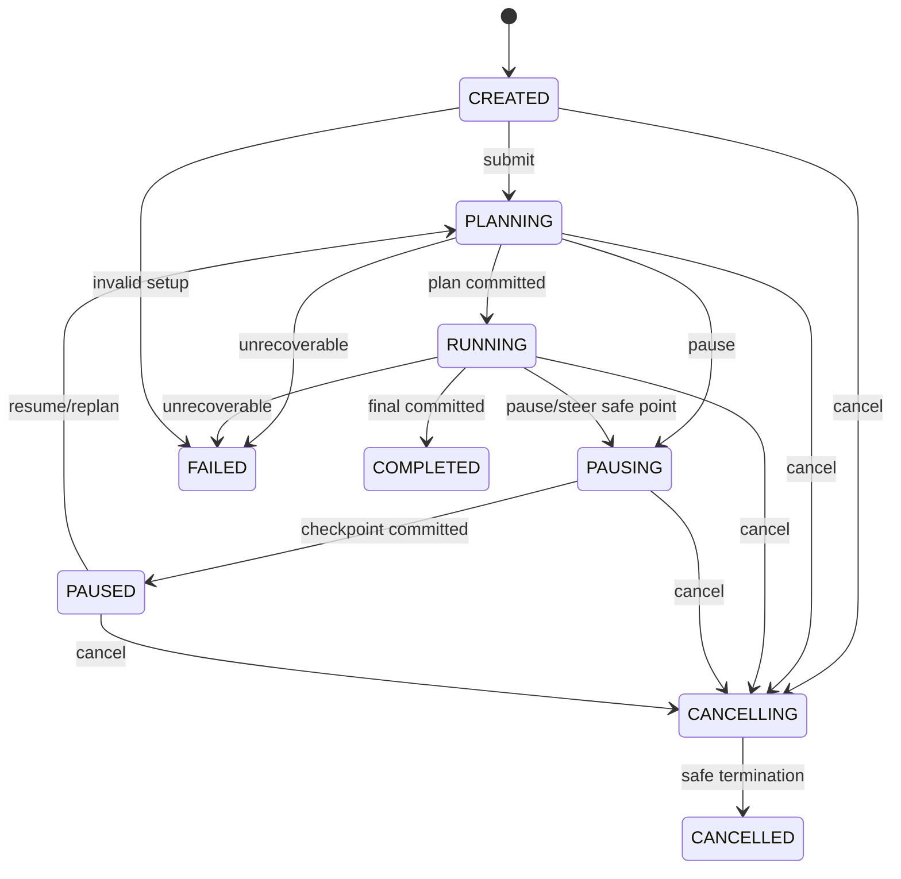

# ThesisGuard Agent Interrupt, Pause, Resume, Rewind & Fork

> 状态：Proposed；当前代码未实现  
> 日期：2026-09-12  
> 权威关系：本文件定义控制协议；总体边界见 [Agent Runtime Architecture](./AGENT_RUNTIME_ARCHITECTURE.md)

## 1. 目标与非目标

目标是让用户在 Agent 长任务中始终拥有控制权，同时不让旧异步结果污染新意图。支持：追加消息、steer、pause、resume、cancel、crash recovery，以及 P1 的 non-destructive fork/rewind view。

非目标：立即杀死任意线程、回滚已提交的 Evidence/Thesis 版本、截断审计历史、在同一 Session 并发多个活动 Run。

## 2. 状态机

V1 使用 9 个持久状态；`REPLANNING` 不单列状态，而是 `revision + 1` 后进入 `PLANNING`。这样只保留一个 revision 和一套转移规则。



### 2.1 状态含义

| 状态 | 含义 | 允许的新操作 |
|---|---|---|
| `CREATED` | Run 已持久化，尚未制定计划 | submit/cancel |
| `PLANNING` | 构建上下文或生成当前 revision 计划 | add-context/pause/cancel/steer |
| `RUNNING` | 执行 step/model/tool | add-context/queue/steer/pause/cancel |
| `PAUSING` | 已接受暂停或 steer，等待 safe point | cancel；其他输入入 inbox |
| `PAUSED` | checkpoint 已稳定提交，无 active execution | resume/steer/cancel |
| `CANCELLING` | 已接受取消，正在等待安全终止或 reconcile | 状态查询 |
| `CANCELLED` | terminal；未提交后续副作用 | fork/new run |
| `COMPLETED` | terminal；final result 已提交 | follow-up/fork/new run |
| `FAILED` | terminal；错误与恢复建议已提交 | retry as new revision/new run |

任何非法转移返回 `409 INVALID_RUN_TRANSITION`，响应包含 current status/revision/allowed actions。

## 3. 输入分类：Queue、Add Context、Steer、Cancel

客户端不应只上传自然语言并让模型猜控制语义；UI 和 API 提供显式 intent，服务端再做权限/状态校验。

| 用户意图 | 协议类型 | 是否改 revision | 处理 |
|---|---|---:|---|
| “完成这个后再比较申菱环境” | `QUEUE_NEXT` | 否 | 新建 pending turn/run，不影响 active run |
| “补充这份刚发布的财报，结论方向不变” | `ADD_CONTEXT` | 通常是 | 若会改变模型输入则作为 steer；仅附件上传可先挂起 |
| “不要看技术面，改为验证订单兑现” | `STEER` | 是 | 记录 intervention，safe point 暂停，revision+1，重规划 |
| “先停一下” | `PAUSE` | 否 | cooperative pause，checkpoint 后 PAUSED |
| “停止这项研究，不要继续” | `CANCEL` | 否 | cooperative cancel，禁止新副作用 |
| “忘掉刚才对旧报告的判断，从财报前开始” | `FORK_FROM`（P1） | 新 run rev=1 | 引用旧 checkpoint 新建分支，不删除历史 |

判断原则：如果新输入会改变当前交付物的目标、范围、风险约束、数据集或应执行工具，就是 steer；如果它是下一项独立工作，就是 queue。

## 4. 定向 Intervention 协议

### 4.1 请求

```json
{
  "intervention_id": "uuid",
  "run_id": "uuid",
  "expected_revision": 3,
  "type": "STEER",
  "payload": {
    "instruction": "忽略技术面，优先验证订单与毛利率兑现",
    "attachments": []
  },
  "idempotency_key": "client-generated",
  "submitted_at": "2026-09-12T14:00:00Z"
}
```

### 4.2 接受条件

1. actor 可访问 session/run；
2. run 是可变状态；
3. `expected_revision == current_revision`；
4. idempotency key 未与不同 payload 冲突；
5. 没有更高优先级 cancel；
6. payload 通过大小、附件与安全策略。

服务端先在事务中追加 intervention；steer 再 CAS `revision = revision + 1`，写 `run.revision_advanced` event。响应是 `ACCEPTED_PENDING_SAFE_POINT`，不是“已完成”。

### 4.3 顺序与冲突

- 同 revision 的多个 steer 只有第一个 CAS 成功；其他返回 `409 STALE_RUN_REVISION`。
- `CANCEL` 优先于 pause/steer；已进入 CANCELLING 后不能 resume。
- `PAUSE` 与 `STEER` 同时到达时，先按 DB sequence 排序；steer 最终落 PAUSED 或 PLANNING 由请求的 `auto_resume` 决定。
- 普通 queue 不改变 active revision，但必须绑定 session 和 `after_run_id`。

## 5. Safe Point 与 Tool 正在运行

Safe point 只有：

- model call 正常完成或 provider 确认取消；
- ToolCall 完成、超时或确认取消；
- tool batch barrier；
- Step result/checkpoint 事务提交后。

不安全边界包括：

- domain transaction 提交中；
- 外部写入已发送但结果未知；
- result 尚未完成 schema/semantic/domain validation；
- event 与状态尚未同事务提交。

### 5.1 Pause

1. 写 `pause.requested`；状态转 `PAUSING`；设置 cancel token。
2. 不再调度新 ToolCall。
3. 对 active read Tool 请求 cooperative cancel；不能取消则等 timeout。
4. 对 active write Tool 进入 reconcile，先确认副作用结果。
5. 在 safe point 写 checkpoint + `run.paused`，转 `PAUSED`。

### 5.2 Steer

Steer 与 pause 共用 safe-point 机制，但它先产生新 revision。旧 revision 活动产物只能落审计区；到达 safe point 后为新 revision 重建 context 和 plan。`auto_resume=false` 时停在 `PAUSED`。

### 5.3 Cancel

1. 状态 CAS 到 `CANCELLING`，写 `cancel.requested`。
2. 清空或取消尚未执行的 inbox/tool calls/approvals。
3. active I/O cooperative cancel；副作用未知则 reconcile。
4. 写 terminal checkpoint、取消原因和残留结果处置。
5. 状态转 `CANCELLED`。

Cancel 不删除已完成 Tool Result、Evidence 或其他不可变记录。

## 6. Run Revision 与 Stale Result 防护

### 6.1 唯一原则

V1 只有一个 `run.revision`。Plan、ContextSnapshot、Step、ToolCall、Proposal 都记录该值；不再定义 Intent Epoch。

### 6.2 双门检查

```text
before_execute:
  assert call.revision == run.revision
  assert run.status == RUNNING

after_execute:
  persist raw/canonical result
  if call.revision != run.revision:
      mark DISCARDED_AS_STALE
      emit audit event
      stop

before_domain_commit:
  assert proposal.run_revision == run.revision
  assert expected_domain_version == current_domain_version
```

这同时防护 Agent intent 竞态和业务 aggregate 竞态。前者用 run revision；后者用 domain version，二者不能混用。

### 6.3 哪些旧结果可复用

旧 Tool Result 不能直接注入新上下文。新 revision 可通过显式 `adopt_artifact` 决策复用，条件是：

- 工具是 read-only；
- 结果 schema 仍匹配；
- freshness 尚有效；
- 输入参数仍被新计划覆盖；
- 不依赖已撤销的用户约束；
- 产生 `artifact.adopted` audit event。

## 7. Checkpoint 合同

每个 checkpoint 至少包含：

```json
{
  "run_id": "uuid",
  "revision": 4,
  "status": "PAUSED",
  "last_completed_step_id": "uuid",
  "next_action": "PLAN",
  "context_snapshot_id": "uuid",
  "committed_tool_call_ids": [],
  "open_tool_call_ids": [],
  "pending_intervention_ids": [],
  "domain_version_refs": [],
  "budget": {"tokens_used": 0, "tool_calls_used": 0},
  "lease_generation": 7,
  "created_at": "..."
}
```

Checkpoint 是 append-only，写入与 `run.paused`/`step.completed` event 同事务。Model 隐藏状态不可作为恢复必需条件；恢复必须能从持久内容重建。

## 8. Resume 与 Crash Recovery

### 8.1 正常 Resume

1. 检查 run 为 `PAUSED`、操作者权限和 idempotency。
2. 读取最后 checkpoint、之后的 durable events、当前 domain versions。
3. 若 domain version 已变化，强制 revision+1 和 replan。
4. 取得新的 DB lease generation；状态转 `PLANNING`。
5. 重建 context，校验 budget/approval/freshness。
6. 从 next action 继续，绝不重放已 committed side effect。

### 8.2 浏览器关闭

浏览器连接与 Run 生命周期分离。断开只写 live subscriber telemetry，不 pause/cancel。用户回来后 `GET /sessions/{id}` + events cursor 恢复 UI。

### 8.3 Worker/API 崩溃

Recovery scheduler 查找 lease expired 的 `PLANNING/RUNNING/PAUSING/CANCELLING` Run：

- 抢占 lease generation；
- 对每个 open ToolCall 查权威状态；
- read-only/idempotent 可重试；
- write unknown outcome 进入 `NEEDS_REVIEW`/FAILED，不盲重试；
- 从最后 stable checkpoint 重建；
- 追加 `run.recovered` 或 `run.recovery_failed`。

## 9. Rewind、Fork、Compact

### 9.1 Rewind

V1 不提供“删除 checkpoint 之后历史”的 rewind。P1 可提供 `fork_from_checkpoint`，UI 可以叫“从这里重新分析”，但后台创建新 Run/Session lineage，原历史保持可见。

### 9.2 Fork

适用于同一 Evidence/Research snapshot 上的独立假设，例如 Bull/Base/Bear 或“订单兑现 vs 估值压缩”。Fork 复制引用，不复制可变业务行：

- `parent_session_id` / `parent_run_id` / `fork_checkpoint_id`；
- 新 run revision 从 1 开始；
- domain snapshot refs 固定；
- 后续 proposal 独立，提交仍受 domain version conflict 保护。

P0 不需要 fork；用单 run 顺序比较足够。

### 9.3 Compact

Compact 产生 versioned conversation summary artifact，记录覆盖的 event range、model、schema 和 hash。原 durable event 不删除。下次 Context Builder 将摘要视为低于 domain fact 的辅助上下文；风险规则、数字和引用从源表重新读取。

## 10. API 草案

```text
POST /api/v1/agent/sessions
POST /api/v1/agent/sessions/{session_id}/runs
GET  /api/v1/agent/runs/{run_id}
POST /api/v1/agent/runs/{run_id}/interventions
POST /api/v1/agent/runs/{run_id}/pause
POST /api/v1/agent/runs/{run_id}/resume
POST /api/v1/agent/runs/{run_id}/cancel
GET  /api/v1/agent/runs/{run_id}/events?after={cursor}
GET  /api/v1/agent/runs/{run_id}/stream
POST /api/v1/agent/runs/{run_id}/fork        # P1
POST /api/v1/agent/sessions/{id}/compact     # P1/manual
```

所有 mutation 要求 `Idempotency-Key`。Intervention 还要求 request body 的 `expected_revision`。HTTP 接受只代表 durable 接收；实际生效通过 event 观察。

## 11. SSE 事件

Envelope：

```json
{
  "event_id": "01J...",
  "event_type": "run.paused",
  "durability": "DURABLE",
  "session_id": "uuid",
  "run_id": "uuid",
  "revision": 4,
  "turn_id": "uuid|null",
  "step_id": "uuid|null",
  "sequence": 42,
  "occurred_at": "...",
  "payload": {}
}
```

客户端按 event id/sequence 去重。`model.delta` 可标 LIVE 且不补偿；`run.*`、`step.*`、`approval.*`、`tool.completed`、`stale.discarded` 必须 durable 并支持 cursor 重放。

## 12. 验收场景

1. Tool 正在慢查询时 steer：请求立刻 durable 接收，旧结果返回后被 stale guard 丢弃，新 revision 重规划。
2. Tool 完成后、结果应用前 steer：raw result 保留，proposal 不提交。
3. domain commit 与 cancel 同时发生：事务先提交则保留不可变版本并在取消结果中说明；cancel 先成功则禁止 commit。
4. 连续两个 steer：只有 expected revision 匹配者成功；另一个得到 409。
5. pause 后重启全部服务：恢复后仍为 PAUSED，resume 不重做已提交 ToolCall。
6. worker 在外部写入响应前崩溃：标 unknown outcome，reconcile 后才能决定完成或失败。
7. Redis 全清：UI 可能丢 token delta，但 Run、approval、checkpoint 和终态可从 PostgreSQL 恢复。
8. SSE 重连：Last-Event-ID 补齐 durable events，不重复显示已经消费的 intervention。
9. compact 后追问具体数字：数字从当前 domain version 重取，而不是相信 summary。
10. fork 后一分支修改假设：另一分支 context 和 revision 不变，业务提交仍通过 expected domain version 冲突检查。

