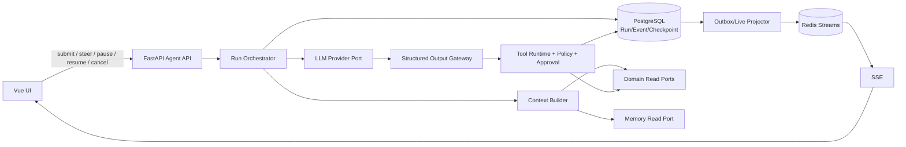

# ThesisGuard Agent Runtime Architecture

> 状态：Proposed / Review Baseline；当前代码尚未实现 Agent Runtime  
> 日期：2026-09-12  
> 适用范围：V1 个人投资研究与决策支持，只读 Agent；禁止自动交易  
> 依赖文档：[开源架构对标](./ARCHITECTURE_REFERENCES.md)、[中断与恢复](./AGENT_INTERRUPT_AND_RESUME.md)、[结构化输出](./STRUCTURED_OUTPUT_CONTRACTS.md)、[Tool 与审批](./TOOL_RUNTIME_AND_APPROVAL.md)、[Memory](./MEMORY_ARCHITECTURE.md)

## 1. Architecture Review 结论

### 1.1 当前真实状态

| 能力 | 判定 | 证据与边界 |
|---|---|---|
| 工程骨架 | 已实现并运行验证 | FastAPI、Vue、PostgreSQL/pgvector、Redis、MinIO、Dramatiq、Compose 均存在；运行中基础依赖健康 |
| Instrument | 部分实现并运行验证 | 模型、迁移、查询 API 和 5 项内置 catalog 可用；不是正式行情/证券主数据源 |
| Watchlist | 部分实现 | CRUD 与分类规则存在；规则含硬编码/合成逻辑，且缺 user scope 等生产约束 |
| Worker | 最小骨架 | 只有 health/echo 类测试 actor，没有研究或 Agent job |
| Redis event helper | 代码存在、非 durable event store | `backend/common/events.py` 只做 Stream append/read；无消费者、重放策略和 DB 事务关联 |
| Research/Evidence/Thesis 等领域 | 目录占位 | 多数包只有 `__init__.py`；没有表、服务、API 或验收闭环 |
| Agent Runtime | 未实现 | `backend/agent` 只有空包；无 session/run/turn/step/tool/approval/checkpoint |
| Structured Output Gateway | 未实现 | 无 contract registry、schema version、repair/validation pipeline |
| Memory | 仅文档设计 | 无表、服务、API；不能算已实现 |
| SSE/WebSocket | 仅 TAD 声明 | 源码未发现实现 |

因此，“WP-01/WP-02 完成”只能解释为**有限工作包交付**，不能推导为产品或 Agent 基础已经完成。WP-01 的官方 `make lint`、`make typecheck`、41 项测试和前端构建通过；但全仓库 `ruff check .` 仍在 migrations/tests 报 17 项问题。WP-02 只覆盖有限 Instrument/Watchlist 切片。

### 1.2 最终建议

保留模块化单体，不引入通用 Agent 框架。未来在 `backend/agent` 内实现一个最小 Run Orchestrator；以 PostgreSQL 为 durable truth，以 Redis 负责唤醒、短租约和 live fan-out，以 Dramatiq 执行可重试后台工作。LLM 只能产出结构化 Proposal；所有业务写入继续由领域服务验证并提交。

V1 的最小可靠架构为：



## 2. 核心领域模型

### 2.1 AgentSession

用户可恢复的交互容器。它保存 conversation lineage、用户/项目 scope、当前 context policy 与最近活动指针；不保存或替代 Evidence、Thesis、Trade Plan 等业务真相。

约束：

- V1 一个 session 同时最多一个 active run。
- session 可跨浏览器和进程恢复。
- session 的对话投影可以 compact，但 durable event 与业务版本不可被覆盖。

### 2.2 Run

一次可执行目标，例如“基于最新财报重验强瑞技术 Thesis”。Run 拥有状态、当前 `revision`、目标、预算、策略快照、输入快照与最终结果。P0 中一个 Run 对应一个 primary Turn；不要在一个已终结 Run 内复活第二项工作。

Run 是并发控制与恢复的主边界。任何改变当前目标、约束或计划的 steer 都使 `revision += 1`。旧 revision 的异步结果不得应用。

### 2.3 Turn

被 Runtime 接受的一次用户意图及其最终 Agent 响应边界。普通 follow-up 在当前 Run 终结后创建**新 Run + 新 Turn**；steer 属于当前 Run/Turn 的 intervention，不伪造一个已完成的新 Turn。保留 Turn 语义是为了对话渲染、协议兼容和未来演进；P0 数据库可以让 `agent_turn.run_id` 唯一，维持一对一。

### 2.4 Step

一次可检查、可 checkpoint 的推进单位。推荐定义为：构建上下文 → 一次模型调用 → 解析零到多个 tool intents → 工具结算 → 形成 step result。每个 step 只属于一个 run revision。

### 2.5 ToolCall

一次工具执行记录，包含冻结参数、参数哈希、权限决定、approval、timeout、attempt、side-effect class、输出 schema、状态和 canonical result。ToolCall 不是普通日志；它是错误恢复和副作用去重的事实记录。

### 2.6 Intervention

用户对 active run 的协议化输入：`ADD_CONTEXT`、`STEER`、`PAUSE`、`RESUME`、`CANCEL`。它记录 target run、expected revision、分类结果、接收/生效时间和 resulting revision。

### 2.7 Checkpoint

可恢复边界，记录 run/revision/step、已提交的 tool calls、未决 inbox、context snapshot 引用、token/费用预算、lease generation 和下一动作。Checkpoint 不复制领域数据，只引用不可变业务版本。

## 3. Runtime Port Protocol

V1 不做动态插件容器，只定义稳定端口：

```python
class LLMProviderPort(Protocol):
    async def complete(self, request: ModelRequest, cancel: CancelToken) -> ModelResponse: ...

class ToolRuntimePort(Protocol):
    async def execute(self, call: ToolCallRequest, cancel: CancelToken) -> ToolCallResult: ...

class DomainReadPort(Protocol):
    async def build_snapshot(self, request: DomainSnapshotRequest) -> DomainSnapshot: ...

class DomainProposalPort(Protocol):
    async def validate_and_commit(self, proposal: DomainProposal, approval: ApprovalRef | None) -> CommitResult: ...

class MemoryPort(Protocol):
    async def retrieve(self, request: MemoryQuery) -> list[MemoryItem]: ...
    async def propose(self, request: MemoryProposal) -> MemoryProposalResult: ...
```

Orchestrator 对外只需要：

```text
create_session
submit_run
submit_intervention
pause_run
resume_run
cancel_run
get_run
list_events(after_cursor)
```

Provider adapter 可以更换，Runtime 生命周期和领域合同不能依赖某家模型 SDK 的内部对象。

## 4. 数据模型与持久化职责

### 4.1 P0 表

| 表 | 关键字段 | 不变量 |
|---|---|---|
| `agent_session` | id, user_id, status, compacted_summary_ref, created_at | conversation 容器，不存业务事实 |
| `agent_run` | id, session_id, status, revision, goal, policy_snapshot, lease_generation, timestamps | 状态与 revision 用 optimistic CAS 更新 |
| `agent_turn` | id, run_id, revision, input, status, timestamps | P0 `run_id` 唯一；追加，不覆盖完成历史 |
| `agent_step` | id, run_id, turn_id, revision, sequence, status, model metadata | `(run_id, revision, sequence)` 唯一 |
| `agent_intervention` | id, run_id, expected_revision, resulting_revision, type, payload, status | 接收和生效可分离；不可静默改投 |
| `agent_tool_call` | id/call_id, run_id, revision, tool, args_json, args_hash, effect, status, result_json/ref | call_id 唯一；最终 result 不可改写 |
| `agent_approval` | id, call_id, args_hash, run_revision, decision, expires_at | revision/args 变化即失效 |
| `agent_checkpoint` | id, run_id, revision, step_id, state_json, created_at | append-only；只引用 domain version |
| `agent_event` | event_id, aggregate, aggregate_id, seq, type, payload, occurred_at | aggregate 内 seq 单调；append-only |
| `idempotency_record` | scope, key, request_hash, status, response_ref, expires_at | 同 key 不同 request hash 返回冲突 |

可以在第一版合并 `turn`/`step` 的少量列，但不能合并掉语义和事件；否则无法解释“用户输入属于新 turn 还是改变当前 step”。

### 4.2 PostgreSQL

- Run 状态、revision、intervention、tool result、approval、checkpoint 和 audit event 的唯一 durable truth。
- 状态更新与 durable event/outbox 在同一数据库事务提交。
- 不用 Redis Stream 代替不可变审计记录。

### 4.3 Redis

- worker 唤醒、短租约、取消 token、rate limit、SSE fan-out。
- 所有 key 有 TTL；Redis 丢失后可从 PostgreSQL 恢复。
- lock 只避免重复工作，不证明业务提交唯一；唯一性由 DB constraint/CAS/idempotency 保证。

### 4.4 Dramatiq Worker

- job payload 只携带 `run_id`、`revision`、`step_id`、`attempt`，不携带权威全量状态。
- 开始与结束均回读 DB 并核对 lease/revision。
- retry 只用于无副作用或显式幂等步骤；未知结果的外部写入不得盲重试。

## 5. Context Builder

Context Builder 是确定性的应用服务，不是“让模型自己搜索所有内容”。输入按以下优先级装配：

```text
System/Security Policy
> ThesisGuard Domain Rules
> Current Explicit Instruction
> Confirmed Risk Constraints / Frozen Plan
> Verified Domain Facts and Evidence
> Current Run/Turn/Checkpoint
> Confirmed Relevant Memory
> Conversation Summary
> Unverified Inference
```

每一块上下文带 `source_type`、`source_id`、`version`、`as_of`、`freshness`、`trust_level`。Token budget 先保留 policy、当前指令和必要输出 schema，再分配事实、历史与 memory；超预算时先丢低相关对话，不能丢风险规则或把旧摘要当新事实。

Context snapshot 记录来源引用和 hash，以便复现；不需要存完整市场数据副本。

## 6. Runtime Event、Domain Event、Audit Event、Live Event

| 类别 | 用途 | Durable | 示例 | 消费者 |
|---|---|---:|---|---|
| Runtime Event | 恢复 Agent 生命周期 | 是 | `run.started`, `step.completed`, `run.paused` | Orchestrator、recovery |
| Domain Event | 陈述业务事实变化 | 是 | `evidence.ingested`, `thesis.version_created` | 领域模块、增量研究 |
| Audit Event | 解释安全/权限/丢弃决定 | 是 | `approval.denied`, `tool_result.discarded_stale` | 用户、审计、排障 |
| Live Event | UI 进度和 token delta | 否，可由 durable cursor 补齐 | `model.delta`, `tool.progress` | SSE/UI |

规则：

- `backend/common/events.py` 当前 Redis Stream helper 只能承载 live fan-out 或 outbox 投影，不能直接升级为 durable truth。
- 同一数据库事务内写业务记录和 domain event/outbox，避免双写裂缝。
- SSE 使用单调 event id；重连携带 `Last-Event-ID`，先补 durable event，再接 live stream。
- token delta 可以丢；状态终结、approval、domain commit 不能丢。

## 7. 一致性、恢复与幂等

### 7.1 Run Revision

所有 model request、tool call、proposal、checkpoint 都携带 `{run_id, revision}`。Runtime 至少在四个位置检查：调度前、Tool 执行前、Tool 返回后、Proposal 提交前。

若当前 DB revision 不等于产物 revision：

1. 保存原始结果和执行成本；
2. 标记 `DISCARDED_AS_STALE`；
3. 发 durable audit event；
4. 禁止进入 context、final answer 或 domain commit；
5. 若新计划仍需要该结果，显式创建新 revision 的新 ToolCall；不偷偷复用。

### 7.2 Browser 关闭与进程崩溃

- 浏览器关闭不取消 Run；UI 重开后按 session/run id 恢复。
- worker 定期续 lease；进程死亡后 lease 超时，recovery job 读取最后 checkpoint。
- `RUNNING` ToolCall 若无权威完成记录，按工具幂等能力处理：幂等读取可重试；外部写入先 reconcile；不可确认则 `NEEDS_REVIEW`。
- 所有 terminal transition 都提交 durable event；不能仅依赖 Dramatiq ack。

### 7.3 Idempotency

- API mutation 接受 `Idempotency-Key`，作用域为 user + operation + target。
- ToolCall 的 `call_id` 在 retry 时保持；参数变化必须新 call_id。
- Domain service 以 proposal id / source version / business unique constraint 防重复。
- 同一个 key 携带不同 request hash 返回 `409 IDEMPOTENCY_CONFLICT`。

## 8. 并发模型

- 一个 Session：P0 只允许一个 active Run；其他输入显式 queue 或创建其他 Session。
- 一个 Instrument：允许多个只读 Run，但提交同一 Research/Thesis aggregate 时使用 expected domain version。
- 同一 Run：只有一个 Orchestrator lease owner；Tool batch 可并行执行无副作用读取，但结果按 step barrier 结算。
- 两份报告同时到达：各自形成 Evidence version；Research Package refresh 以 observed source set 创建新版本，不能覆盖。
- 用户连续 steer：每次 compare-and-set revision。落后请求收到 409 并携带 current revision，前端要求用户重新确认。

## 9. Failure Semantics

| 场景 | Runtime 结果 | 是否重试 | 用户可见信息 |
|---|---|---|---|
| LLM timeout | Step `FAILED_RETRYABLE` | 预算内，指数退避 | 模型超时、已完成步骤保留 |
| Tool timeout（只读幂等） | ToolCall timeout | 可有限重试 | 哪个数据源超时 |
| Tool timeout（外部写入） | `UNKNOWN_OUTCOME` | 先 reconcile，不盲重试 | 需要确认/人工检查 |
| 结构化输出校验失败 | Validation failed | 最多一次受限 repair | schema/semantic errors |
| Approval 超时/无人处理 | `DENIED_TIMEOUT` | 否 | 未执行副作用 |
| Revision stale | `DISCARDED_AS_STALE` | 新计划显式重发 | 旧结果被保留但未应用 |
| Worker crash | lease expired | 从 checkpoint 恢复 | 恢复点与重试步骤 |
| Redis 丢失 | live/coordination degraded | 从 DB 重建 | 可能丢 token delta，不丢状态 |
| Domain optimistic conflict | proposal conflict | 重读后重新提案 | 当前业务版本已变化 |
| Context 超预算 | deterministic truncation | 否 | 记录被省略来源和预算 |

## 10. Observability

每条 log/trace/event 至少包含：`trace_id`、`session_id`、`run_id`、`revision`、`turn_id`、`step_id`、`tool_call_id`（如有）、`user_id_hash`、`model`、`provider`、`latency_ms`、`token_usage`、`cost_estimate`、`result_status`。

关键指标：

- run success/pause/cancel/fail rate 与 duration；
- steer acceptance/conflict/safe-point latency；
- stale result discard count；
- checkpoint recovery success；
- tool timeout/retry/unknown outcome；
- structured output first-pass/repair/manual-review rate；
- approval wait/deny/expiry；
- context token distribution 与 freshness violations。

禁止记录 secrets、原始凭据、完整用户私密文档和未脱敏 portfolio。Prompt/response 如需排障，存受控对象引用并配置保留期。

## 11. P0、P1 与明确拒绝

### P0：Agent 开始实现前必须具备

- 领域先决条件：Research Package、Evidence、Thesis 的版本化读取与 Proposal 合同。
- Session/Run/Turn/Step、单 active run、run revision、状态机。
- submit/steer/pause/resume/cancel 与 safe-point cooperative cancellation。
- Tool Registry、Policy、Approval、immutable Tool Result。
- Structured Output Registry 与 Pydantic + semantic/domain validation。
- PostgreSQL durable event/checkpoint/idempotency；Redis live fan-out。
- Context Builder；仅 session/working memory，不做自动长期画像。
- SSE durable cursor 补偿、基本 metrics/traces。

### P1：证明 P0 可靠后

- hypothesis fork/bull-base-bear 并行分支。
- 非破坏性 rewind view、手动/自动 compact UI。
- Preference/Discipline/Episodic long-term memory 与 review center。
- 多 provider 路由、成本策略、缓存、离线 eval/replay。
- 更细粒度并行 tool DAG；跨 session 复用已验证 read artifact。

### 明确拒绝

- 自动下单、券商交易 Tool、无确认的 Trade Plan/Thesis 高影响写入。
- 通用插件平台、Cordis 类依赖注入树、动态加载任意代码。
- V1 多 Agent swarm、自治 subagent delegation、跨 Agent 共享黑箱 memory。
- Kubernetes、分布式工作流引擎、event sourcing 所有业务表。
- 向量化全部对话/记忆、自动人格推断、LLM 自己决定长期记忆。
- 破坏性删除/截断 Thesis、Trade Plan、Evidence 和纪律历史。

## 12. Work Package 重排与依赖

| 顺序 | Work Package | 状态/目标 | 依赖 |
|---:|---|---|---|
| 1 | WP-01 Engineering Skeleton | 已交付有限骨架；补齐全仓质量门禁列入维护 | 无 |
| 2 | WP-02 Instrument + Watchlist | 已交付有限垂直切片；正式数据源/user scope 未完成 | WP-01 |
| 3 | WP-03 Research Package | 下一包：版本化研究包、模块 freshness、来源引用、领域读取合同 | WP-02 |
| 4 | WP-04 Evidence | 证据摄取、source grading、immutable evidence version | WP-03 |
| 5 | WP-05 Thesis Engine | Thesis version、validation、score ledger、proposal contract | WP-04 |
| 6 | WP-06 Structured Output + Tool Policy Foundation | contract registry、validator、tool policy/approval 基础 | WP-03~05 合同 |
| 7 | WP-07 Agent Runtime Core | Session/Run/Revision/Step/Checkpoint/SSE | WP-06 |
| 8 | WP-08 Interrupt & Resume | steer/pause/resume/cancel/recovery/stale guard | WP-07 |
| 9 | WP-09 Research UI | 可观察 run、证据、proposal、approval UX | WP-03~08 |
| 10 | WP-10 Read-only Agent | 端到端研究 Agent | WP-09 |
| 11 | WP-11 Incremental Update | 新证据触发重验与通知 | WP-04~10 |
| 12 | WP-12 Long-term Memory | preference/discipline/episodic memory | 稳定的领域记录与 WP-10 |

**唯一推荐的下一工作包：WP-03 Research Package。** 原因是 Agent Runtime 目前没有可依赖的 Research/Evidence/Thesis 领域合同；先做 Runtime 会迫使它把 prompt、任意 JSON 或对话摘要当事实源，直接违背 Thesis First 和 Fact > Narrative。

## 13. Architecture Decision Records

### ADR-001：模块化单体内实现最小 Run Orchestrator

- Decision：在 `backend/agent` 内实现明确的状态机应用服务，不引入外部通用 Agent 框架。
- Why：当前团队/部署规模小，但中断、恢复、stale guard 是真实可靠性需求。
- Alternatives：无 orchestrator 的 request handler；Temporal/LangGraph/Cordis 类框架。
- Rejected because：前者无法持久恢复；后者在领域合同尚未稳定时显著增加运维和抽象成本。
- Consequences：需要自己维护有限状态机与事件合同；架构更可控、可审计。

### ADR-002：PostgreSQL 是 Runtime durable truth

- Decision：Run、ToolCall、Checkpoint、Approval、durable event 全部落 PostgreSQL。
- Why：当前已有 PostgreSQL，且状态事务与业务提交需要一致性。
- Alternatives：Redis Streams 为真相；纯 JSONL；专用 event store。
- Rejected because：Redis 丢失/裁剪风险高；JSONL 不适合并发 API；专用系统过重。
- Consequences：Redis 可安全重建；需 outbox 与索引治理。

### ADR-003：只使用 Run Revision 一个意图代数

- Decision：所有 steer/replan 递增 `agent_run.revision`。
- Why：一个 compare-and-set 值足以隔离旧模型、工具和 Proposal 结果。
- Alternatives：Intent Epoch + Plan Version + Context Version 多计数器。
- Rejected because：会产生组合状态、测试负担和解释歧义。
- Consequences：Plan 是 revision 的不可变快照；上下文来源仍单独 versioned，但不参与 run CAS。

### ADR-004：Cooperative cancellation + safe point

- Decision：暂停/取消在模型或 Tool 的受控边界生效；禁止强杀领域提交事务。
- Why：外部 I/O 和不可变业务写入无法可靠回滚。
- Alternatives：立即 kill worker；完全不支持 cancel。
- Rejected because：强杀产生未知副作用；无 cancel 不能满足用户控制。
- Consequences：UI 必须显示“正在安全暂停/取消”；Tool 必须接收 cancel token。

### ADR-005：LLM 只输出结构化 Proposal

- Decision：schema + semantic + domain 三层验证后，由领域服务提交。
- Why：LLM 不是 system of record，且财务结论需可验证来源。
- Alternatives：prompt 约定 JSON；模型直接 ORM/API 写入。
- Rejected because：前者不可靠，后者破坏权限和版本不变量。
- Consequences：需要合同注册表、schema version 和 repair/NEEDS_REVIEW 流程。

### ADR-006：Approval 精确绑定 ToolCall

- Decision：approval 绑定 tool、call id、args hash、run revision、actor 和 expiry。
- Why：聊天中的泛化同意无法证明用户批准了哪个副作用。
- Alternatives：session 级“全部允许”；仅按 tool name 记忆授权。
- Rejected because：参数或上下文改变后可越权复用。
- Consequences：steer/revision 变化会使未使用 approval 失效，用户可能需要重新确认。

### ADR-007：Runtime Event 与 Domain Event 分离

- Decision：Agent 生命周期和业务事实用不同 event type/aggregate/消费者。
- Why：可以重放对话，不等于可以改写 Thesis 或交易纪律。
- Alternatives：单一通用事件日志；只保留应用日志。
- Rejected because：前者模糊真相边界，后者不能可靠恢复。
- Consequences：需要统一 envelope 与跨事件 correlation id。

### ADR-008：P0 单 Session 单 active Run

- Decision：并行研究使用不同 session；同一 session 其余输入 queue/steer。
- Why：消除“当前消息发给哪个 run”的大部分歧义。
- Alternatives：每个 session 多 active run；全局单 run。
- Rejected because：前者增加 UI/锁/上下文复杂度；后者限制不同研究任务。
- Consequences：并行 Bull/Bear fork 推迟到 P1。

### ADR-009：Compact 不压缩业务事实

- Decision：只压缩 conversation projection；领域事实每次按版本重新装配。
- Why：摘要会遗漏数字、来源和风险条件。
- Alternatives：把总结文本当永久 memory；每次发送全部历史。
- Rejected because：前者不可审计，后者不可扩展且成本高。
- Consequences：Context Builder 和来源引用成为必需组件。

### ADR-010：Long-term Memory 推迟到 P1

- Decision：P0 仅持久 session、working state 和确认的 run constraints。
- Why：当前连 Research/Evidence/Discipline 领域事实都未实现，无法可靠推导长期画像。
- Alternatives：先做向量记忆；把所有对话自动入库。
- Rejected because：会强化错误、混淆事实和偏好，并扩大隐私风险。
- Consequences：Memory 文档先冻结合同，等领域基础与 Agent P0 稳定后实施。

### ADR-011：固定 Tool Registry，不做插件系统

- Decision：工具由代码注册，显式 schema、risk、timeout、idempotency、owner。
- Why：V1 工具数量少，安全审查价值高于动态扩展。
- Alternatives：MCP/Cordis 风格任意插件；模型生成工具代码。
- Rejected because：供应链、生命周期、权限和调试成本超出 V1 收益。
- Consequences：新增 Tool 需发布代码并通过合同测试；可在需求成熟后再引入 provider adapter。

### ADR-012：不实现破坏性 rewind

- Decision：所谓“回退”创建新 revision/checkpoint 或 fork，不删除 durable history。
- Why：项目明确要求不可变历史。
- Alternatives：截断对话与业务记录；数据库覆盖到旧快照。
- Rejected because：损害审计与投资决策复盘。
- Consequences：存储会增长，需要 retention/归档；用户看到的是“基于旧点新建分支”。

## 14. 对现有文档的建议变更（本任务不直接修改）

### PRD

- 增加 Agent 用户控制语义：queue、steer、pause、resume、cancel、approval、stale result 提示。
- 明确 V1 不自动交易、不自动写 Thesis/Trade Plan、不自动形成长期风险偏好。
- 把 Work Package 状态与验收级别分开，避免“目录已建”被解释为“能力完成”。

### TAD

- 用本文件补齐 Session/Run/Turn/Step、revision、checkpoint、event taxonomy、Tool Pipeline 和 Structured Output。
- 将 Redis Streams 从含混的事件基础设施降格为 live fan-out/outbox projection。
- 将“下一步 WP-01”更新为真实路线；重复 TAD 文件确认无引用后再清理。

### AGENTS.md

- 加入 Runtime 不变量：LLM only proposes、expected revision、stale discard、approval binding、single active run。
- 把“自动生成 API client”加入可执行验收；当前 `apps/web/src/api/client.ts` 是手写 URL，与规范存在漂移。

### README

- 把“当前为原型”更新为“WP-01 与有限 WP-02 已实现”；展示 Implemented / Planned 矩阵。
- 链接本架构文档，避免 README 内继续维护另一份 Agent 语义。

## 15. 最终验收问题

1. Agent 执行一半时用户如何改变方向？——发送定向 `STEER`，携带 run id 与 expected revision；在 safe point 生效并生成新 revision。
2. 已完成的有效结果如何保留？——ToolCall/Step/Checkpoint 追加保存；新 revision 可重新引用通过 freshness/contract 检查的 immutable domain artifact。
3. 旧 Tool Result 为什么不会污染新任务？——每个结果带 run revision；返回后和提交前均做 CAS，不匹配即 `DISCARDED_AS_STALE`。
4. 用户暂停后第二天如何继续？——浏览器不是状态持有者；Runtime 从 PostgreSQL checkpoint、event 和 domain version 恢复，重新取得 lease。
5. 什么属于长期用户记忆？——经确认、跨任务稳定且有个性化价值的偏好、风险规则、纪律摘要或精选 episode。
6. 什么绝不能进入 Memory？——凭据、未验证市场事实、Thesis/Trade Plan 权威值、原始敏感文档、未经确认的情绪/人格推断。
7. Memory 与 Research Fact 有什么区别？——Memory 个性化选择；Research Fact 有来源、时间和 domain version，是研究事实层。
8. 哪些 Tool 可自动执行？——显式 registry 中的无副作用、限定 scope、可审计的 `AUTO_READ`，以及只产生 proposal 的 `AUTO_PROPOSE`。
9. 哪些动作必须用户确认？——业务写入、敏感信息处理、冻结/修订高影响对象、删除/归档等；V1 交易动作一律禁止。
10. 什么时候需要 fork？——P1 比较相互独立的假设且需要共享同一历史快照时；不是为普通 follow-up。
11. 什么时候应该 queue 而不是 steer？——输入是下一项独立工作或不会改变当前目标/约束时；改变当前交付物就 steer。
12. 两份报告同时到达会发生什么？——各自产生 immutable Evidence；Research/Thesis 提交用 expected domain version，冲突者重读并新建版本。
13. LLM 输出不符合 schema 怎么办？——保存失败、返回结构化错误，最多一次受限 repair；仍失败则 `NEEDS_REVIEW`，绝不直接入库。
14. 什么才叫最小可靠 Agent Runtime？——可持久恢复、可定向 steer/pause/cancel、有 revision stale guard、Tool policy/approval、结构化合同、领域写边界、durable audit 和可观察失败；少一个都只是 demo loop。
