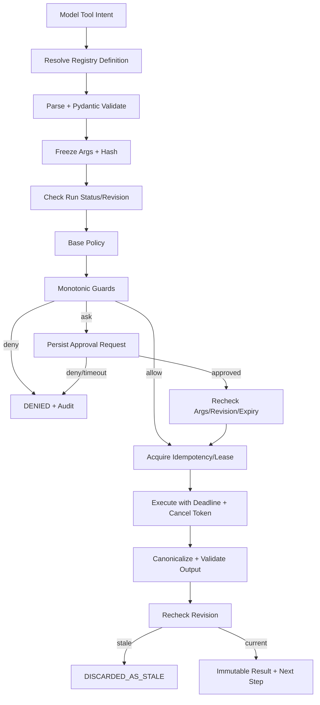

# ThesisGuard Tool Runtime, Policy & Approval

> 状态：Proposed；当前项目只有普通 Python service/helper，没有 Agent Tool Runtime  
> 日期：2026-09-12  
> 适用范围：V1 研究读取、结构化提案和受控领域写入；交易动作禁止

## 1. 设计目标

Tool Runtime 把“模型想调用什么”与“系统允许并实际执行什么”分开。每次调用必须可验证参数、可判定风险、可取消/超时、可幂等恢复、可审计输出，并受 run revision 防护。

参考 DeepSeek Harness 的 schema/pipeline/monotonic guard 与 fail-closed approval 思路，但 V1 使用固定代码注册表，不引入插件平台。上游证据见 [Architecture References](./ARCHITECTURE_REFERENCES.md)。

## 2. Tool Definition

```python
class ToolDefinition(BaseModel):
    name: str
    version: str
    description: str
    owner_module: str
    input_contract: str
    output_contract: str
    effect: Literal["READ", "PROPOSE", "WRITE", "SENSITIVE_WRITE", "TRADE"]
    default_policy: Literal[
        "AUTO_READ", "AUTO_PROPOSE", "CONFIRM_WRITE", "CONFIRM_SENSITIVE", "DENY"
    ]
    timeout_ms: int
    max_attempts: int
    idempotency: Literal["PURE", "IDEMPOTENT", "RECONCILABLE", "NON_IDEMPOTENT"]
    data_classification: set[str]
    required_scopes: set[str]
    supports_cancel: bool
    max_output_bytes: int
```

定义在发布时注册，重复 name/version/schema hash 不一致必须启动失败。模型得到的是最小描述和 input schema，不得到执行函数、凭据或内部网络信息。

## 3. ToolCall 合同

```text
call_id                        # retry 保持不变
session_id / run_id / revision / turn_id / step_id
tool_name / tool_version
arguments_json / arguments_hash
effect / policy_decision
approval_id
status / attempt / timeout_at
raw_result_ref / canonical_result_json
error_code / retry_disposition
started_at / completed_at
```

参数在第一次 validation 后 canonicalize + freeze；任何参数变化都创建新 call id。Result 只允许从非终态转入一个终态，不覆盖完成结果。

## 4. 固定执行流水线



Guard 只能把 `ALLOW → ASK → DENY` 收紧，不能把上游 deny 放宽。执行器不自行弹审批、不读聊天历史判断同意。

## 5. Policy 等级

| 等级 | 语义 | 示例 | 默认 UX |
|---|---|---|---|
| `AUTO_READ` | 无副作用、限定数据域、结果可审计 | 读取已授权财报、查询当前 Research Package、读取市场 regime | 自动执行，展示来源/时间 |
| `AUTO_PROPOSE` | 只创建 proposal/draft，不改变权威业务状态 | Evidence extraction proposal、Thesis revalidation proposal | 自动执行，标注“待验证/待确认” |
| `CONFIRM_WRITE` | 可恢复或低/中影响业务写入 | 加入/移出 watchlist、保存研究模块版本 | 显示 diff/目标/参数；用户明确命令可充当一次性确认 |
| `CONFIRM_SENSITIVE` | 风险、纪律、隐私或难恢复写入 | 冻结/修订 Trade Plan、改变 risk preference、归档研究、处理敏感 portfolio | 强确认；显示后果、版本和不可变历史 |
| `DENY` | V1 明确禁止 | 下单、撤单、券商资金操作、绕过领域服务、任意 shell/SQL | 不执行，给出产品边界 |

“用户明确命令可充当确认”只在 API 已将该文本绑定到精确 action/args hash，且 UI 展示实际参数时成立；不能把会话中较早的“可以”泛化复用。

## 6. 初始 Tool 清单

### 6.1 P0 Read

| Tool | Policy | 关键限制 |
|---|---|---|
| `instrument.resolve` | AUTO_READ | 只查 Instrument Service；无 catalog 外部猜测 |
| `watchlist.get` | AUTO_READ | 当前 user scope |
| `research.get_package` | AUTO_READ | version/as_of 必填 |
| `evidence.search` | AUTO_READ | 授权来源、limit、time range；返回 source refs |
| `thesis.get_current` | AUTO_READ | 返回明确 version |
| `market.get_regime` | AUTO_READ | observed_at/freshness 必填 |

### 6.2 P0 Propose

| Tool | Policy | 结果 |
|---|---|---|
| `research.propose_refresh` | AUTO_PROPOSE | ResearchModuleProposal |
| `evidence.propose_extraction` | AUTO_PROPOSE | EvidenceExtractionResult |
| `thesis.propose_revalidation` | AUTO_PROPOSE | ThesisRevalidationProposal |

### 6.3 Write/Sensitive

| Tool | Policy | 备注 |
|---|---|---|
| `watchlist.add/remove` | CONFIRM_WRITE | 用户当前明确请求可一次确认；批量删除升级敏感 |
| `research.commit_version` | CONFIRM_WRITE 或领域自动策略 | 只由 Research Service append version |
| `thesis.commit_version` | CONFIRM_SENSITIVE | V1 material change 必须确认 |
| `trade_plan.commit_revision` | CONFIRM_SENSITIVE | 只追加版本，永不覆盖 frozen plan |
| `memory.commit` | CONFIRM_WRITE/SENSITIVE | 取决于 memory type；风险偏好为 sensitive |
| `broker.*` | DENY | V1 不注册执行器 |

## 7. Approval 对象

```json
{
  "approval_id": "uuid",
  "tool_call_id": "uuid",
  "run_id": "uuid",
  "run_revision": 5,
  "tool_name": "thesis.commit_version",
  "tool_version": "1.0.0",
  "arguments_hash": "sha256:...",
  "effect_summary": "创建 Thesis v4；不覆盖 v3",
  "risk": "CONFIRM_SENSITIVE",
  "requested_by": "agent-runtime",
  "decision": "PENDING",
  "decided_by": null,
  "expires_at": "..."
}
```

### 7.1 Approval 不变量

- 没有可用的用户 answerer 时 fail closed。
- pending approval 不阻塞数据库连接或 worker 线程；Run 可处于 `PAUSED`/waiting reason。
- approve 前重新校验 actor、run revision、tool version、args hash、domain version 与 expiry。
- steer、cancel、args 变化、contract retirement 或 expiry 使 approval 失效。
- approval 只允许 `APPROVED`、`DENIED`、`EXPIRED`、`INVALIDATED` 一次终结。
- approval 不包含 secrets；UI 展示脱敏但足够具体的 diff 和后果。
- “approve all”不进入 V1；相同只读 Tool 本来就应由 Policy 自动允许。

## 8. Timeout、Cancellation 与 Retry

### 8.1 Deadline

Runtime deadline 取以下最小值：Run 剩余预算、Step deadline、ToolDefinition timeout、外部数据 freshness window。超时产生结构化错误，不把半截文本当成功。

### 8.2 Cooperative Cancellation

每个执行器接收 cancel token，并在网络请求、分页、批处理和提交前检查。已进入 domain transaction commit 区后完成事务再报告，不强杀。

### 8.3 Retry 矩阵

| Idempotency | 例子 | 自动 retry |
|---|---|---:|
| `PURE` | 本地确定性校验 | 是，有限次数 |
| `IDEMPOTENT` | 固定 snapshot/version 的读取 | 是，有限次数、同 call id |
| `RECONCILABLE` | 以 proposal id 创建版本 | 先查询结果，再决定 |
| `NON_IDEMPOTENT` | 未提供 idempotency 的第三方写入 | 否；unknown outcome 人工处理 |

指数退避带 jitter；429 尊重 retry-after；validation、permission、approval deny、stale revision 不重试。

## 9. Output 与错误

Tool Result 使用 [Structured Output Contracts](./STRUCTURED_OUTPUT_CONTRACTS.md) 的 canonical schema。标准错误：

```text
TOOL_NOT_REGISTERED
TOOL_VERSION_RETIRED
ARGUMENTS_INVALID
POLICY_DENIED
APPROVAL_REQUIRED
APPROVAL_DENIED
APPROVAL_EXPIRED
RUN_NOT_EXECUTABLE
STALE_RUN_REVISION
TOOL_TIMEOUT
TOOL_CANCELLED
UPSTREAM_RATE_LIMITED
UPSTREAM_UNAVAILABLE
OUTPUT_INVALID
UNKNOWN_SIDE_EFFECT_OUTCOME
DOMAIN_VERSION_CONFLICT
```

错误包含 machine code、retryable、safe_message、details ref、observed_at 和 correlation ids；不得把 stack trace 或 secret 返回给模型/前端。

## 10. 数据与隐私边界

- Tool 获得最小化输入，不默认继承完整 conversation/memory。
- portfolio、用户身份、原始文件按 data classification 控制；日志脱敏。
- 外部 Provider 不接收不必要的原始附件/账号信息。
- URL fetch 只允许 allowlist、大小/类型限制、重定向与 SSRF 防护。
- 文档解析产物与原文件分别存储；原文件在 MinIO，结构化事实在 DB。
- 工具凭据来自 secret manager/environment，不进入 ToolCall args、memory 或 prompt。

## 11. Observability

Span 层级：Run → Step → Policy → Approval wait → Tool attempt → Output validation。指标包括每 Tool 的调用量、p50/p95/p99、timeout、retry、deny/ask、approval latency、output invalid、stale discard、unknown outcome、payload bytes 和 cost。

审计事件至少有：`tool.proposed`、`tool.policy_decided`、`approval.requested/decided/expired`、`tool.started/completed/failed/cancelled`、`tool.result_discarded_stale`、`domain.proposal_committed/rejected`。

## 12. 测试与验收

- Registry 重复/漂移时启动失败。
- 每个 Tool 有 input/output contract fixture 与 effect/policy snapshot test。
- deny 不会被后续 guard 放宽；无人审批时 fail closed。
- approval args/revision/version 任一改变都会失效。
- pause/cancel 不再启动新 Tool；active Tool 在 safe point 停止。
- stale Result 保留审计但不会进入下一模型请求或领域提交。
- retry 不重复创建业务版本；unknown side effect 不盲重试。
- raw response 超限/含敏感信息时不进入普通日志或 model context。
- `broker.*` 在 V1 无注册定义，即使模型请求也返回 POLICY_DENIED。

