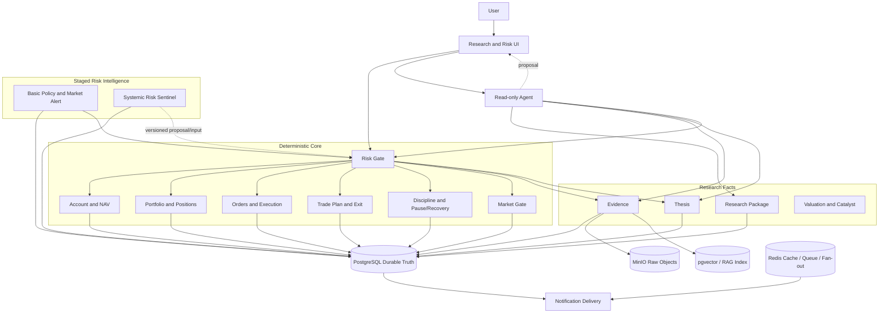

# 论衡 ThesisGuard V1 技术架构设计（TAD）

> Version: 2.0-draft
>
> Updated: 2026-09-14
>
> Status: **TECH_DESIGN_DRAFT**
>
> Product Direction: **APPROVED**
>
> PRD: **PRD_DRAFT**
>
> Strategy Validation: **UNPROVEN**
>
> Canonical product decision: [PRODUCT_GOAL_REALIGNMENT_2026-09-14.md](PRODUCT_GOAL_REALIGNMENT_2026-09-14.md)

## 1. 文档目标与边界

本文定义 ThesisGuard V1 的架构目标、模块优先级、依赖、权威数据边界和故障降级原则。它不在本次目标调整中批准新的数据库表、API、OpenAPI、前端页面、Agent Runtime 细节、数据接入或宏观算法。

架构服务于以下产品北极星：

> **ThesisGuard 是一套面向个人 A 股现金账户的、证据驱动的风险与决策操作系统。它帮助用户避免无法承受的错误，并用可审计的前瞻数据验证个人交易方法是否存在扣除成本后的优势。**

架构口号：

> **Agent 可以不可用，风险门必须继续工作；LLM 只提案，确定性领域服务才提交事实与状态。**

## 2. Architecture Decision Summary

1. `Personal Risk OS` 是确定性生存内核，不依赖 LLM、RAG、通知或 Agent 在线。
2. Evidence 和 Thesis 是 Agent 的事实依赖；Agent 不能在它们之前成为核心可交付能力。
3. Account、Portfolio、Market、Trade Plan、Order/Execution、Discipline 必须在 Agent 之前形成可靠读取边界。
4. PostgreSQL 是结构化业务状态与不可变版本元数据的 durable truth；MinIO 保存原始对象；pgvector/RAG 是可重建索引；Redis 是缓存、队列或分发基础设施。
5. LLM、Redis、pgvector 和通知系统都不能成为金融事实、风险状态、交易状态或 Evidence 的唯一真相。
6. 缺少、过期、冲突或无法核验的关键输入时，对新增风险 fail-closed。
7. 历史 Evidence、Thesis、Trade Plan、订单、成交、纪律、暂停、告警和规则版本不可覆盖。
8. Macro Risk Sentinel 分为基础政策/市场告警与系统性风险哨兵，不等同于确定性危机预测。
9. 策略参数和动作路径必须版本化；个人交易模型 v1.3 / 系统 v1.1 本次不变。
10. 系统不自动下单、不控制券商、不代替用户确认交易意愿。

## 3. Current Architecture Reality

Evidence cutoff：2026-09-14，`main@bd4b1d7`。状态不得由目录、文档或提交标题单独推断。

| Area | Observed state | Evidence | Boundary |
|---|---|---|---|
| Engineering skeleton | IMPLEMENTED locally | FastAPI/Vue/PostgreSQL/Redis/MinIO/Dramatiq/Compose files | 不证明生产部署 |
| Instrument / Watchlist | PARTIALLY_IMPLEMENTED | models/services/API/migration/tests | 正式数据源和完整用户边界未证明 |
| Research Package | Capability `IMPLEMENTED`; verification evidence: targeted backend L3 `VERIFIED`; overall quality-gate result `UNKNOWN` | code + migration + 16 current backend tests；OpenAPI artifact drift recorded | 不证明真实研究内容生成、生产使用或全部质量门禁绿色 |
| Evidence | CONTRACT_ONLY on main | frozen WP-04 contract + historical acceptance | 无 main models/migration/service/API |
| Thesis / Market / Portfolio / Trade Plan / Discipline / Agent | DESIGN_ONLY or PLANNED | placeholder packages + design docs | 无领域实现 |
| WP-04 persistence branch | PARTIALLY_IMPLEMENTED on unmerged branch (L1 static evidence; historical L4 acceptance claim) | `codex/wp04-evidence-persistence@4201ae7` | 未合并到 main；不能当 canonical current capability 或整个 WP-04 完成 |

两份 TAD 在本次修改前内容与 SHA-256 完全相同。当前文件是 canonical TAD；`ThesisGuard_V1_Technical_Architecture_Design (1).md` 保留为非 canonical 历史副本，不随本次重写更新。

## 4. Target Architecture



虚线表示提案或可选输入，不表示直接领域写入。所有产生风险状态、准入、暂停恢复或历史版本的写入必须进入相应 Domain Service。

## 5. Module Priority and Boundaries

### 5.1 Foundation

`common` 提供配置、数据库、事件、安全和存储基础设施。它不能包含绕过领域服务的“通用写入”入口，也不能把 Redis Stream 当 durable audit truth。

### 5.2 Instrument and Watchlist

负责标的主数据、别名/关系和观察列表。分类或标签不能伪装成 Evidence 结论；正式数据来源与用户范围需要独立验证。

### 5.3 Research Package

负责 Research Package 和 Research Module 的版本化容器、freshness 和 source references。WP-03 的增量刷新表示包级 copy-on-write/version refresh；WP-08 表示新 Evidence 触发的端到端重新验证、账本和通知，两者不得混同。

### 5.4 Evidence

负责：

- `SourceDocument / SourceDocumentVersion`；
- `EvidenceSeries / EvidenceVersion`；
- source locator、grade、verification、freshness；
- 去重、幂等、并发、纠错、争议、撤回和来源关系；
- PostgreSQL 元数据、MinIO 原始对象和可重建向量索引之间的边界。

详细合同以 [WP04_EVIDENCE_DOMAIN_CONTRACT.md](WP04_EVIDENCE_DOMAIN_CONTRACT.md) 为准。它是 `CONTRACT_ONLY`，不是实现证据。

### 5.5 Thesis

负责不可变 Thesis Version、Evidence 引用、验证、支持/反驳、Score Ledger、下一验证日期和证伪条件。Thesis 只能引用可定位的 Evidence 版本；LLM 可以提出 Thesis candidate 或 revalidation proposal，不能直接提交最终状态。

### 5.6 Personal Risk OS

Risk OS 是 P0 确定性内核，由以下清晰边界组成。

#### Account and NAV

计算账户单位净值、外部出入金中性化、历史高点、当前回撤、`AccountState`、`PauseStatus`、`RecoveryEligibility` 和 `NewRiskPermission`。自然语言不能直接解除暂停。

#### Portfolio and Position

保存当前持仓、可卖数量、对象分类、单股/权益市值、主动风险 H、产业和共同风险因子。`LEGACY_PRE_MODEL` 与 `LONG_TERM_ETF` 单列但进入全账户风险。

#### Order and Execution

订单、成交、撤单、拒单、部分成交和迟到回报是独立事实。未终结订单持续预占现金、市值和风险；撤单请求不等于撤单完成。

#### Trade Plan and Exit

冻结 `Pmax / S0 / T / q_plan` 及费用版本，维护价格退出、逻辑退出、时间复核和 `EXIT_PENDING`。历史计划通过新版本修订，不覆盖。

#### Discipline and Recovery

记录计划外新增、超数量、扩大预算/止损、摊低成本、拖延退出、暂停事件、整改、Recovery ID 和恢复耗尽。盈亏结果不改变违规事实。

#### Market Gate

V1 生产门只实现冻结策略要求的双指数检查及其来源、as_of 和 freshness。旧七阶段情绪模型属于历史设计，不得静默覆盖个人交易模型 v1.3 / 系统 v1.1。

#### Risk Gate

聚合 Research/Evidence、Thesis、Market、Account、Portfolio、Order、Trade Plan、Discipline 与用户确认，输出既有 `AssessmentStatus` 和 `ActionDecision`。任何关键输入未知时禁止新增风险。

### 5.7 Research and Risk UI

UI 是确定性状态的展示与用户确认面，不是风险计算器。UI 可以提前原型化，但没有领域服务和真实数据时必须显示 `DESIGN_ONLY / MOCK`，不能呈现为已完成闭环。

历史 ID `WP-06 Research UI` 保持不变；风险视图是与 WP-RISK-01 的集成范围，不通过重命名破坏历史验收引用。

### 5.8 Read-only Agent

“只读”按权限而不是按是否能生成文本定义：

1. Agent 可以读取授权的领域查询模型；
2. Agent 可以生成无副作用、带来源和版本上下文的 Proposal；
3. Proposal 只有经用户确认和确定性 Domain Service 校验后，才可能产生新的领域版本；
4. 数据摄取流水线的确定性提交不是 Agent 写权限。

Agent 永久禁止：raw SQL、直接 ORM session、任意内部写 API、券商订单、风险阈值修改、暂停解除、关键输入未知时 `ALLOW`。Agent Runtime 不得把 prompt、对话摘要或长期 Memory 当金融事实。

### 5.9 Incremental Update

WP-08 负责从新 Source/Evidence 到 Research/Thesis revalidation、风险影响、通知和审计的端到端链。每步保留输入版本、as_of、freshness、幂等键和结果；失败不能覆盖最后一个已验证版本。

### 5.10 Macro Risk Sentinel

`WP-ALERT-01` 先实现权威政策来源、原文、发布日期、生效日期、适用对象、影响链、市场价格/宽度/流动性确认，并将结果映射到新增风险许可或账户复核。

`WP-MACRO-01` 后续增加信用、杠杆、房地产、银行/非银、跨境、美元流动性、利差、估值、波动、融资、相关性和去杠杆压力，以及历史回放和误报/漏报/提前量评估。

两阶段都不输出确定性危机日期。初期宏观结果不直接清空已有持仓；未来强制降仓必须使用独立策略版本并通过用户批准。

### 5.11 Notification

Notification 读取已提交的领域事件，负责去重、送达、确认和失败重试。通知失败不能改变风险或交易事实；Redis/推送供应商不是告警真相源。

## 6. System-of-Record Matrix

| Information | Durable truth | Secondary / derived | Forbidden authority |
|---|---|---|---|
| Instrument/Research/Evidence/Thesis metadata | PostgreSQL domain records | API read models | LLM response |
| Raw documents and files | MinIO object + PostgreSQL identity/version | local cache | vector chunk alone |
| Semantic retrieval | Rebuildable pgvector/RAG index | embeddings/cache | pgvector as sole Evidence truth |
| Account/position/order/trade facts | PostgreSQL append-only/versioned ledgers | UI/cache/import staging | chat memory |
| Risk/market/discipline state | Deterministic service result + input/rule snapshot in PostgreSQL | Redis/cache/UI | Agent judgment |
| Policy/macro observations | versioned source and observation records | calculated signals | untraceable narrative |
| Runtime state | PostgreSQL for durable state | Redis queue/fan-out | Redis alone |
| Notification delivery | PostgreSQL delivery/audit record | provider receipt/cache | provider UI alone |

## 7. Data Provenance, Freshness and Fail-Closed

决策关键数据统一保存：

```text
source identity
source document/version or account import identity
published/effective date when applicable
observed_at / acquired_at / as_of
verification status
freshness status and evaluated_at
normalization or calculation version
```

WP-04 持久化 `VerificationStatus` 使用已冻结 Evidence Domain Contract 的生命周期枚举：`UNREVIEWED / PENDING_REVIEW / VERIFIED / REJECTED / DISPUTED / INVALIDATED / RETRACTED`。

交易准入另行派生 decision-use freshness/eligibility 轴：综合上述生命周期状态、来源时点、时效窗口与未解决冲突，计算 `VERIFIED / UNVERIFIED / STALE / CONFLICTING / MISSING`。其中 `STALE / CONFLICTING / MISSING` 是准入判断，不得静默写入或替代 WP-04 的 `verification_status` 字段。`UNKNOWN` 用于计算或最终状态无法判定；对新增风险必须按 `NO TRADE` 处理。

对新增风险，以下任一情况必须 fail-closed：

- 账户、持仓、未结订单或可卖数量无法核验；
- Research/Evidence、双指数、Setup、价格/数量、费用或券商能力关键数据缺失；
- 来源过期、存在未解决冲突或时间口径不一致；
- 退出、暂停、恢复或 replacement PK 状态不完整；
- 用户未确认接受计划亏损。

Fail-closed 的动作是阻止新增风险并列出缺口，不是伪造事实、自动卖出所有持仓或让 Agent 猜测。

## 8. Frozen Strategy Boundary

本架构承载但不修改个人交易模型 v1.3 / 系统 v1.1：Setup B 唯一路径、双指数过滤、六项准入、最多 4 只股票、第五只 replacement PK、无杠杆、无摊低成本、不下移保护价、第一轮不加仓/不做 T、订单预占、`EXIT_PENDING`、账户暂停/有限恢复、旧仓/ETF 单列和历史不可覆盖。

策略规则必须由 versioned policy evaluator 加载。架构重构不能改变数值或边界语义。任何参数或路径变化必须建立独立策略版本、迁移协议、历史重演、前瞻模拟和用户批准。

## 9. Deterministic Decision Flow

### 9.1 SC-001 Pre-market

```text
account snapshot
  → positions and sellable quantity
  → open/cancel-pending/late orders
  → exit and pause locks
  → protection prices
  → data freshness
  → NewRiskPermission + Must Do / Must Not Do
```

### 9.2 SC-002 New-risk admission

```text
SC-001 eligibility
  → Research/Evidence
  → market dual-index gate
  → Setup B
  → Pmax/S0/T/q_plan/fees
  → net-cost RR
  → cash/value/H/order reservations
  → 4-stock capacity/replacement PK
  → user confirmation
  → ActionDecision
```

### 9.3 SC-003 Exit and review

```text
price/logical/account exit trigger
  → EXIT_PENDING
  → sellable quantity + objective constraints
  → order/fill reconciliation
  → realized net P&L and optional R_net
  → MFE/MAE
  → EntryClass vs Execution
  → discipline/pause/remediation
```

## 10. History, Versioning and Audit

以下记录必须 append-only 或通过新版本表达：

- source/evidence identity and version；
- Research Package/Module；
- Thesis and validation；
- policy/risk rule version；
- account snapshot, cash flow and NAV；
- Trade Plan and revisions；
- orders, fills, cancels and late reports；
- exit triggers and objective constraints；
- discipline, pause, recovery and remediation；
- policy/macro alert and delivery attempts；
- ActionDecision input snapshot and evaluator version。

修正错误时保存 supersedes/corrects/invalidates 关系，不删除原始记录。缓存、索引或 UI 的“当前视图”可以重建，但不能替代历史源。

## 11. Failure and Degradation Semantics

| Failure | Required behavior |
|---|---|
| LLM/Agent unavailable | deterministic risk/UI remains available; no lost truth |
| pgvector unavailable | semantic search degrades; source/evidence identity remains queryable |
| Redis/worker unavailable | queue/notification delayed; durable state remains; no invented completion |
| MinIO unavailable | raw artifact access degraded; affected Evidence cannot be upgraded without verification |
| account/broker import incomplete | state UNKNOWN or pause lock; new risk prohibited |
| market/policy data stale | affected gate fails/unknown per policy; no unconditional ALLOW |
| notification provider fails | retry and audit; domain state unchanged |
| concurrent version write | optimistic concurrency conflict; no silent overwrite |

## 12. Security and Authority

- 单用户 V1 仍应显式限定账户和数据范围；不能依赖“只有我使用”绕过授权边界。
- 原始文件、账户数据和交易日志不得默认发送给未批准的外部模型。
- Tool Registry 采用 allowlist；Agent 只获得领域查询与 proposal surface。
- 高影响变更绑定具体 proposal、输入版本、用户确认和 Domain Service 校验。
- 日志不得泄露凭据、券商 token 或完整敏感账户信息。
- 本系统不提供券商交易 Tool。

## 13. Work Packages and Dependency Map

历史 WP-01 至 WP-08 的 ID 和名称保持：

| WP | Name | Current state | Dependency |
|---|---|---|---|
| WP-01 | Engineering Skeleton | IMPLEMENTED local skeleton | — |
| WP-02 | Instrument + Watchlist | PARTIALLY_IMPLEMENTED | WP-01 |
| WP-03 | Research Package | Capability `IMPLEMENTED`；verification evidence：targeted backend L3 `VERIFIED`；overall quality-gate result `UNKNOWN` | WP-02 |
| WP-04 | Evidence | CONTRACT_ONLY on main | WP-03 |
| WP-05 | Thesis Engine | DESIGN_ONLY / NOT_STARTED | WP-04 |
| WP-06 | Research UI | PLANNED | WP-03/04/05 + WP-RISK-01 read models |
| WP-07 | Read-only Agent | DESIGN_ONLY / PLANNED | Evidence, Thesis, Risk OS, UI/query boundaries |
| WP-08 | Incremental Update | PLANNED | WP-04/05/07 |

新增非冲突 ID：

| WP | Name | Purpose | Dependency |
|---|---|---|---|
| WP-RISK-01 | Personal Risk OS | deterministic account/portfolio/order/plan/exit/discipline/market gates | WP-05; design may start earlier |
| WP-ALERT-01 | Basic Policy & Market Alert | source-grounded policy and price-confirmed alert | WP-08 + WP-RISK-01 |
| WP-MACRO-01 | Systemic Risk Sentinel | staged systemic vulnerability/pressure evaluation | WP-ALERT-01 |
| WP-VALIDATION-01 | Forward Validation & Model Governance | forward, cost-adjusted, versioned validation | cross-cutting; evaluation after prior capabilities |

```text
WP-01 → WP-02 → WP-03 → WP-04 → WP-05 → WP-RISK-01
      → WP-06 → WP-07 → WP-08 → WP-ALERT-01
      → WP-MACRO-01 → WP-VALIDATION-01
```

Agent Runtime proposal 文档中复用 WP-06～WP-08 的编号不是 canonical work package identity。若未来采纳其拆分，必须使用非冲突 ID 或通过单独决策原子性更新所有权威文档和任务引用。

## 14. Validation Architecture (Future Design Required)

后续领域设计必须为以下验证留下接口和不可变数据：

- deterministic replay：同一输入和规则版本产生同一结果；
- historical replay：只能使用当时可知信息；
- forward simulation：保留未成交、跳过和失效信号；
- account reconciliation：现金、持仓、订单、成交、费用和公司行动闭合；
- strategy cohorts：按模型版本、Market Regime、产业、持有期、退出、EntryClass 和 Execution 分层；
- macro shadow mode：评估增量价值、误报、漏报和提前量；
- rule governance：参数变化新建版本，不覆盖旧样本。

压力测试、历史回放和前瞻验证需要未来单独技术设计。本 TAD 不预先批准表结构或算法。

## 15. Non-Functional Requirements

### Traceability

每个关键 `ActionDecision` 可追溯到输入快照、来源/时点、freshness、策略版本、领域服务版本和用户确认。

### Reliability

风险门的读取和计算不依赖 Agent；订单/成交对账、暂停和退出状态优先于推荐体验。任何恢复过程都不得通过丢弃历史或重置高点来“修复”。

### Testability

领域服务提供纯计算或明确 I/O 边界，覆盖正常、缺失、过期、冲突、并发、部分成交、迟到回报、不可卖和恢复耗尽案例。

### Observability

区分领域事件、运行事件、告警投递和审计事件。运行成功不能替代业务正确；告警送达不能替代状态提交。

### Performance

性能优化不得把不可变历史、来源验证或 fail-closed 改成最终一致的猜测。缓存 miss 应回源 durable truth 或明确降级。

## 16. Explicit Non-Goals

- 自动下单、自主调仓、券商客户端控制；
- 高频、分钟级、做 T、杠杆和多市场全覆盖；
- 自动在线学习或自动修改生产策略；
- 将 LLM、Memory、Redis、pgvector 或通知作为金融事实源；
- 用未校准宏观分数预测危机日期或自动清空持仓；
- 在本次文档调整中设计未批准 API、数据库表或算法；
- 宣称稳定盈利、回本、胜率或超额收益。

## 17. Architecture Readiness

| Scope | State | Meaning |
|---|---|---|
| TAD | TECH_DESIGN_DRAFT | 目标边界已对齐，详细领域合同仍按工作包设计 |
| WP-04 | READY_TO_CONTINUE_IMPLEMENTATION | Evidence contract 已冻结；main 实现缺失 |
| WP-05 | NEEDS_DOMAIN_DESIGN | 依赖 WP-04 |
| WP-RISK-01 | READY_FOR_PRODUCT_AND_DOMAIN_DESIGN | 不等于批准 migration/API |
| WP-07 | NOT_READY_TO_IMPLEMENT_AS_CORE | 事实和风险依赖未完成 |
| Macro | PLANNED | 数据与校准路径未知 |
| Production strategy | UNPROVEN / NOT_READY | 无足够扣成本前瞻证据 |

## 18. Recommended Next Architecture Action

下一项最小、明确、可验证的工作是：

> **在不扩展 Agent、Macro 或 WP04-02+ 范围的前提下，对未合并的 WP04-01 Evidence persistence 切片执行独立集成审查与当前 HEAD 重验；仅在另行获得 Git 集成授权后，才把该切片纳入 main。**

该动作的完成证据必须来自实现、迁移、测试和真实数据库链，而不是提交标题或验收文档名称。

## 19. 一句话架构定义

> **ThesisGuard 是以 PostgreSQL 不可变领域记录为 durable truth、以 Evidence 与 Thesis 为事实基础、以确定性 Personal Risk OS 为决策内核、以只读 Agent 为解释与提案层的模块化单体；任何关键数据未知时禁止新增风险。**
